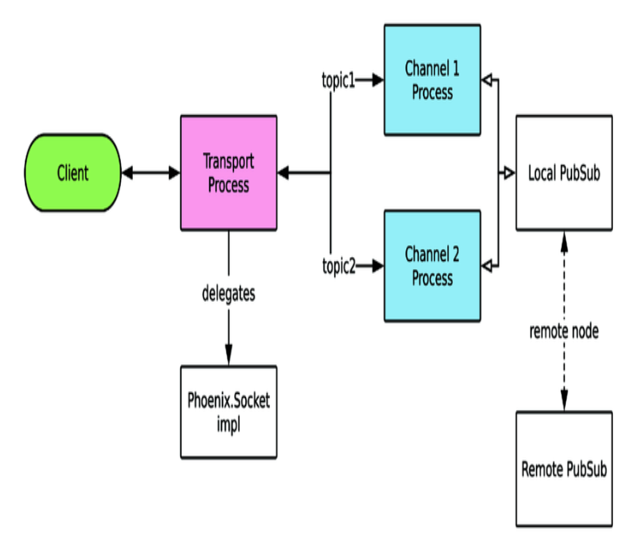
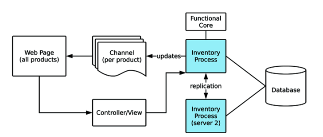
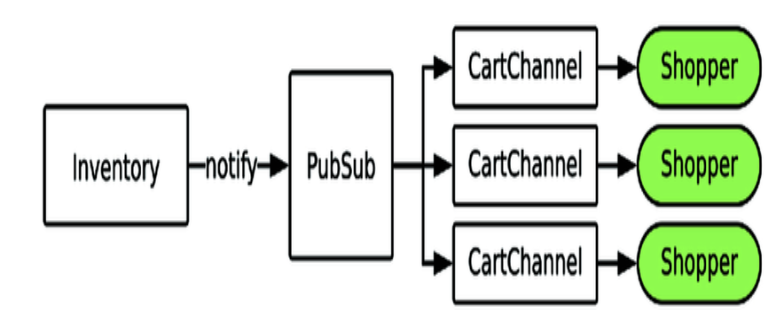

# real-time-phoenix-notes

## By: Albert Lee hanzhupeng@gmail.com

构造一个实时的网络应用，是当下网络应用的需求。以往这种技术是很复杂，成本高昂的。现在Phoenix框架给出了一个可行的且成本可以接受的技术方案。当然分布式系统本质上是复杂的，但学习研究它是值得的，可以为业务系统带来巨大的回报。另外本身，这门技术也很有趣。

《Real-Time Phoenix - Build Highly Scalable Systems with Channels》

本项目里是内容摘要与读书笔记，注意，并不是翻译。阅读时对照本书原文。
好像不登录，github只能看到 README，所以把全文都放这里了。

Phoenix是 Elixr语言的一个Web开发框架，Elixir是基于Erlang虚拟机的一个函数式编程语言。# Chap1 Real-Time is Now

## By 韩祝鹏

Real-Time 的网络应用是当下的需求，随着技术的发展，变得容易了。激动人心.

（安迪-比尔定律，多核、网络的发展，高并发实时连接的需求）

*用户希望应用能反应当前世界的状态。*

Users expect applications to reflect the corrent state of the world.

（整个应用，或整个公司，甚至整个网络，都应该是一个整体的。公司产品的各个相关方：用户-运营人员-管理者，都应该理论上能实时看到当前整个世界的状态，并相应作出立即的动作）

传统的实时技术（iframe）等，需要适配不同的浏览器。

## 实时 的定义

- 硬件，硬实时（飞机控制系统等）
- 软实时
- 不需要用户介入，更新当前的状态。

## The Layers of a Real-time system 实时系统的各个层

*Clients - 实时通讯层-后台服务器群（共同完成业务目标）*

### Client 客户端层
- 用户界面的控制
- 维持与服务器的连接
- 主要问题：网络连接的不稳定性

### Communication Layer 通讯层
	Persistent connection，维持长连接
	HTTP/2 ， Server-sent events and WebSockets
	本书使用 WebSocket
	客户端与服务器不要绑定在一种通讯层技术上，要解耦，适应未来可能的技术发展变化。

### Server 服务端
	Client 通过通讯层连接到“单一的”server上，连接尽可能保持。
	传统的web应用是短连接。
	实时系统与传统web应用，都是与服务器发request，不同点在于实时系统的请求是“有状态”的。
	Statefulness。

	HTTP的web request 是无状态的，服务器在请求之间不维护状态。客户端发每个HTTP request，必须发送状态，如cookie。
	实时系统的服务器，可以把状态与特定的连接相关联。（如用户和应用的数据）
	这样实时系统不需要在每次接到request的时候，都重新组装整个world的环境（如数据库等连接，涉及到的用户与应用的各种状态数据环境），这会减轻大量的工作，因此响应会快的多。（并且开发起来简单很多。）

	传统web，多个服务器是尽量隔离的，因为request无状态，这样可以容错，扩展。
	实时系统，需要各个server互相之间是连接在一起的，需要知道哪个用户连接在哪个server，并互相通信。

	维护多个实例的状态与行为的应用，就是分布式的应用。分布式应用有很多好处，也有很多挑战。

### Scalability 可扩展性
	可扩展性的类型：性能，可维护性，成本

#### 性能的可扩展性
	实时系统有些特有的扩展性问题，如大量的实时连接的服务器之间共享信息。

#### 维护性的可扩展性
	添加新特性，debug，持续运行。
	维护性差意味着添加新特性或改bug时，开发人员要花费更多的时间，而且很受挫。

	可维护性是“面向未来”的问题，因此很容易被忽视。
	通过清晰的分层，划分边界，最佳实践，可以提高未来的可维护性。

### 成本的可扩展性
	CPU、内存，带宽，未来的开发时间
	Erlang应用相对成本低，成功案例：WhatsApp

### 各个可扩展性之间关系矛盾，需要取舍。“fast，reliable，cheap--pick two”
#### 性能 vs 成本
		当新特性的开发优先级更高时，通过花钱砸服务器先解决
		也可以通过云服务器，动态伸缩服务器的数量。

#### 性能 vs 可维护性
		打破层之间的 边界，将通讯层与业务代码紧耦合，能提高性能，但会严重降低可维护性。
		应该最大化可维护性，这样新的特性容易后续添加。（牺牲一些性能，成本投入，等待未来硬件性能提升等）。这在商业上是更有利的选择。

		当性能改进的收益大过新特性的时候，在考虑。

#### 可维护性 vs 成本
		人很贵！
		不去还技术债，可以短期最小化成本，但长期成本增加。（而且是非线性的增加，早晚会到临界点，推倒重来会是唯一的选择）。

## 用Elixir 实现实时性
	Elixir语言较为灵活，表达能力强，降低代码的复杂度，因此降低维护成本。（代码简洁，可维护性好）
	Elixir构建在 Erlang/OTP 之上，利用虚拟机的轻量级进程，通常使用 GenServer，封装和建模实时系统中的各个模块。
	扩展Elixir应用，只要简单的将各个服务器连接起来，就得到了一个集群。
	（Actor模型，天然的分布式优势。在单机上纵向扩展，利用多核，或多机的横向分布扩展）

	任何的系统，尤其是实时系统，都需要数据和错误处理的隔离。
	Erlang历史上是为电话交换机开发设计的，天然需要数据的隔离，一个通话的崩溃不会影响其他的通话。
	用 Erlang 的 Process来分隔系统里的各个模块。

	Elixir是开发实时系统的狠好的选择，但需要深入理解 OTP的设计思想和最佳实践。


## Building Real-Time Systems
	Phoenix是Elixir语言开发Web框架。
	Phoenix Channel是构建实时系统的组建。
	其他的库： GenStage， Phoenix Tracker。后续章节介绍。

## 总结
	现代应用对实时性的需求，各种可扩展性及成本等的考虑，易用性，各种因素最终指向了 Elixir及 Phoenix。
# Real-Time Phoenix 2 - Connect a Simple WebSocket

## by: 韩祝鹏

客户端设备可能是手机、PC或各种IoT设备。
WebSocket是当前实时web应用的基础，因此理解WebSocket的原理很重要。
（在负载均衡后面，WebSocket连接可能有问题，内存的使用，等，都需要理解WebSocket原理）

## Why WebSockets

以前的实时通讯技术，有浏览器兼容性问题。开发成本高。

2011年HTML5引入了WebSocket协议，用来解决实时web通讯问题。现在主流的浏览器已经都原生支持了。

- WebSocket允许在一个TCP连接里做双向的数据通讯。降低带宽消耗和连接的建立消耗。
- Elixir里用 cowboy web server 对WebSocket支持的很好，对应到Erlang的Process model。
- WebSocket起源于 HTTP request，因此各种技术如负载均衡，Proxy都可以使用。
  
应用：Facebook的聊天，Yahoo财经的实时股票数据，多人在线网络游戏。

## Connecting our First WebSocket

创建实例项目

`$ mix phx.new hello_sockets --no-ecto`

由于墙的存在，deps get：

`HEX_MIRROR=http://hexpm.upyun.com HEX_HTTP_CONCURRENCY=1 mix deps.get`

修改 assets/js/app.js  ：

`import socket from "./socket"`

启动：

`mix phx.server`

## WebSocket Protocol
学习如何建立连接，保持连接alive，发送和接受数据，保持连接的安全性。
需要深度Debug的时候，读RFC。
学习调试，用Chrome的DevTools。

### 建立连接
打开 Chrome DevTools->Network -> WS ，访问实例项目的页面。
(两个WebSocket连接，其中一个是开发环境用来reload代码的。)

Request Headers，Response Headers, HTTP method(GET)

WebSocket从一个普通的Web Request开始，然后"upgraded" 到一个 WebSocket。

发出Request后，收到 101 response status code， “101 Switching Protocols”。从HTTP变成WebSocket。这样设计可以兼容以前的服务器代理。

WebSocket可以用于浏览器，也可以用于非浏览器环境，如服务器间或移动客户端。

过程：

1. 发出 GET HTTP连接请求，到 WebSocket endpoint
2. 收到服务端返回的 101 code
3. 升级协议到 WebSocket
4. 通过WebSocket连接进行双向通讯

### 发送接收数据

DevTools 里 Message Tab下，可以看到上行，下行的消息。全双工连接（full-duplex connection)。

扩展协议。

### Staying Alive, Keep-Alive

WebSocket协议规定了 Ping-Pone frame，确定连接依然活着，这是可选的，Phoenix没有用它。
客户端每30秒发送心跳信息给Phoenix服务器。Phoenix服务器如果一段时间收不到Ping消息就会关闭连接，默认60秒。

`发送：[null,"57","phoenix","heartbeat",{}]`

`接受：[null,"57","phoenix","phx_reply",{"response":{},"status":"ok"}]`

客户端负责检查连接，等发现连接断了，可以立刻重连。

### 安全性

- 生产环境需要使用 wss:// https 协议来保证安全性。
- Request的 Header里，检查Origin，确定来源。
- WebSocket 不适用 CORS保护 cross-origin resource sharing.
- 注意跨域问题。CSRF攻击

## Long Polling， 另一种实时的选择

在特定情况下，可以使用不同的通讯层，WebSocket并不是唯一的。
WebSocket和Long Polling可以同时使用。

### Long polling的request流程：

1. 客户端创建 HTTP request
2. 服务端不 response 这个 request，而是留着它。等有了新数据或过一段时间，再response。
3. 服务器发送完整的response到客户端，此时客户端收到了服务器的实时数据。
4. 客户端 loops

### 是否使用 Long Polling

优点：
    Long Polling完全基于 HTTP。

不足：
    [总结Long Polling的问题与最佳实践](https://tools.ietf.org/html/rfc6202)
    - 资源的浪费，每次请求都要处理 Request Headers
    - 网络不好时消息的延迟严重。

相对来说，WebSocket长连接要好的多，不需要每次都重发Header，重新连接。

Long Polling在负载均衡时可能有好处，因为经常重新建立连接。而WebSocket总是连在一台服务器上，连接的越长，越不容易更换。

## WebSocket 与 Phoenix Channels

Phoenix对不活跃的WebSocket连接进行休眠处理，占用很少内存。
# Real-Time Phoenix 3 - First Steps with Phoenix Channels

## by: 韩祝鹏

Phoenix Channels 是我们的实时应用的核心。


## What are Phoenix Channels

channels工作在一个高层抽象，让客户端连接的web server，并订阅各种topic。客户端发送和接收订阅的topics上的消息。一个连接可以订阅多个topic，不需要创建昂贵的多个连接。

> *注意* 每个Channel 都是一个 GenServer，每个client join进一个Channel，就会创建这个连接相应的 Channel 进程。客户端连接中断后，相应的channel进程就结束。一个Channel进程是对应到一个Client连接上的。

从Client的视角：

1. subscribe topics
2. send/receive data (on the topics)

从 Server的视角：

- 用OTP的process设计，容错性。
- Transport agnostic，应用使用了 WebSocket，但并不是被它限定的。理论上可以方便的替换通讯层的实现，而不需要改动业务逻辑。（设计的分隔，类似于Spring依赖注入的思想）
  
## 理解 Channel的结构



- client通过一个连接机制（如 WebSocket）直接连接到一个管理连接的OTP Process。
- Transport Process将特定操作代理到应用代码里，我们的应用实现 Phoenix.Socket behaviour。（实现各个回调函数，处理特定事件） 在 HelloSocketsWeb.UserSocket 模块里。
- 每一个不同的Topic都有分开的进程处理。
- Phoenix.Socket 模块，讲客户端的请求路由到实现 Phoenix.Channel 的模块。
- Phoenix.PubSub 用于Channel间路由消息。允许集群消息广播。

## Sockets
职责：连接的处理，路由。确定连接的安全验证，用户id标识，定义及route topic。

一般使用 Phoenix.Socket， 如果特殊情况需要定制实现不同的传输方式，可以实现自己的 Phoenix.Socket.Transport。

要实现的回调函数：
- connect/3  （可以用来实现安全检查）
- id/1   （确定不同连接client的id）

`hello_sockets/lib/hello_sockets_web/channels/user_socket.ex`


```elixir
use Phoenix.Socket
## Channels
channel "ping", HelloSocketsWeb.PingChannel
```

channel 宏定义一个topic，并route到一个指定的 Channel 实现module。

## Channels
放置业务逻辑，应用的请求处理代码。职责：

- 接受或拒绝 join 请求
- 处理client发的消息
- 处理PubSub来的消息
- 向client推送消息

Channel类似 MVC里的Controller。Socket模块类似 Router。

*skinny controllers* 设计，尽量让应用逻辑放在应用的内核里，而不是在 Channel里实现。与实时连接相关的逻辑，放在这里。

Channel 就是在GenServer上做的一层包装，因此可以处理GenServer的各个回调函数。

callback函数：

- join/3
- handle_in/3
- handle_out/3
- terminate/2
- handle_info/2
- handle_call/3
- handle_cast/2
- code_change/3

示例代码：

```elixir
defmodule HelloSocketsWeb.PingChannel do
  use Phoenix.Channel

  def join(_topic, _payload, socket) do
    {:ok, socket}
  end

  def handle_in("ping", _payload, socket) do
    {:reply, {:ok, %{ping: "pong"}}, socket}
  end
end
```

join/3 用于加入认证。

handle_in 处理事件，参数：event,payload, 当前socket的状态。收到消息后，可以：

- 回复信息： {:reply, {:ok, map()}, Phoenix.Socket}
- 不回复: {:noreply, Phoenix.Socket}
- 断开Channel， {:stop, reason, Phoenix.Socket}

用 wscat 可以在命令行实验

```shell
sudo npm install -g wscat
wscat -c 'ws://localhost:5000/socket/websocket?vsn=2.0.0'
Connected (press CTRL+C to quit)
> ["1","1","ping","phx_join",{}]
< ["1","1","ping","phx_reply",{"response":{},"status":"ok"}]
> ["1","2","ping","ping",{}]
< ["1","2","ping","phx_reply",{"response":{"ping":"pong"},"status":"ok"}]
>  ["1","2","ping","ping2",{}]
< ["1","1","ping","phx_error",{}]
## 这时服务端上，PingChannel进程终止，并被重启
>  ["1","2","ping","ping",{}]
< [null,"2","ping","phx_reply",{"response":{"reason":"unmatched topic"},"status":"error"}]
> ["1","1","ping","phx_join",{}]
< ["1","1","ping","phx_reply",{"response":{},"status":"ok"}]
>  ["1","2","ping","ping",{}]
< ["1","2","ping","phx_reply",{"response":{"ping":"pong"},"status":"ok"}]
```

#### Fault Tolerance

与传统Web controller不同的是，Channel是常驻的。现实中会遇到bug以及网络断开等，进程会crash。

在上面的例子里client发出未定义的消息，channel进程会crash，然后重启，这是client需要重新join。官方的JavaScript客户端已经处理了这种情况。

channel重启了，但是客户的connection并没有断，客户如果join了其他的channel，其他channel也不会受到影响。

#### 其他

Channel可以自动休眠，减少内存占用。设置Channel的休眠时间（默认15秒）

```elixir
use Phoenix.Channel, hibernate_after: 60_000
```

### Topics

topic 是一个string，习惯上用 "topic:subtopic" 格式。因为 channel/3 可以使用通配符。

```elixir
channel "ping", HelloSocketsWeb.PingChannel
channel "ping:*", HelloSocketsWeb.PingChannel
channel "wild:*", HelloSocketsWeb.WildcardChannel
```

在Channel的实现模块里，通过join/3 回调可以自定义topic名称通配符的判断规则：

```elixir
defmodule HelloSocketsWeb.WildcardChannel do
  use Phoenix.Channel
  def join("wild:" <> numbers, _payload, socket) do
    if numbers_correct?(numbers) do
      {:ok, socket}
    else
      {:error, %{}} end
    end

  def handle_in("ping", _payload, socket) do
    {:reply, {:ok, %{ping: "pong"}}, socket}
  end

  defp numbers_correct?(numbers) do
    numbers
    |> String.split(":")
    |> Enum.map(&String.to_integer/1)
    |> case do
      [a, b] when b == a * 2 -> true
      _ -> false
    end
  end
end
```

上面的代码里，如果 client join发过来的是 wild:1:2 就join 成功，如果不是 wild:[Int]:[Int]这样的格式 Channel进程就会崩溃重启，但至少阻止了不合法的连接。

> 读源代码， lib/phoenix/socket.ex ，用的macro，在编译时将名称字符串生成了模式匹配的源代码。这块实现类似Common Lisp了。


### Topic 名称的选择

动态的Topic名称，可以实现特定用户，或特定群组的私有消息，如 "notifications:t-1:u-2" 这样格式，可以指明 Team 1 下的 User 2.系统可以在任意位置，向指定的用户发送消息，只要提供相应的用户id。

选择Topic名称，对扩展性很重要。例如一个提供库存更新的Channel，可以用不同的方式实现：

- "inventory" 不同SKU之间没有区分。一个商品的变化，将广播到所有连接的客户端，即使这个客户端并不关心这个商品。代码简单，但会用掉更多带宽，并且暴露全部的数据。
- "inventory:*" 用通配符区分不同的SKU。需要连接多个topic，每个商品一个，但对不关注的商品不会发送数据。

## PubSub

Phoenix.PubSub (publisher/subscriber)，实现topic订阅与消息广播。Channel在内部使用 PubSub，一般不用跟它打交道，但要理解它，才能更好的配置及确保性能及扩展性。

PubSub 在本地node 和所有连接的远程 node之间都连接。可以让PubSub在整个集群里广播消息。多个PubSub之间的通讯，PubSub内置使用pg2 adapter。另外还有一个基于 Redis的adapter，不需要node之间连接在一起。（见Chap11 部署应用）

看 pubsub的源代码，broadcast的实现，也是通过注入的 adapter 实现具体的功能。依赖注入。

broadcast例子：

```shell
iex(6)> HelloSocketsWeb.Endpoint.broadcast("ping","test", %{data: "test"})
:ok
```

```shell
$ wscat -c 'ws://localhost:5000/socket/websocket?vsn=2.0.0'
Connected (press CTRL+C to quit)
> ["1","1","ping","phx_join",{}]
< ["1","1","ping","phx_reply",{"response":{},"status":"ok"}]
< [null,null,"ping","test",{"data":"test"}]
```

## 发送与接收消息

### Phoenix Message Structure

Message的内容可以让客户端追踪请求和回复的流，因为单个Channel会有多个异步的请求。

```elixir
defmodule Phoenix.Socket.Message do
    @type t :: %Phoenix.Socket.Message{}
    defstruct topic: nil, event: nil, payload: nil, ref: nil, join_ref: nil
```

- `:topic` - The string topic or topic:subtopic pair namespace, for example "messages", "messages:123"
- `:event`- The string event name, for example "phx_join"，Channel的实现可以用模式匹配来处理不同的event。
- `:payload` - The message payload， JSON map
- `:ref` - The unique string ref，发送消息时递增数字
- `:join_ref` - The unique string ref when joining，join到topic时递增的数字

官方的 Channel客户端库，在发送请求时，给出 join_ref, ref, topic，服务端返回消息时，带有相同的 join_ref,ref,topic，这样客户端就可以方便的组织消息的处理。

### 从客户端接收消息

客户端的消息通过Socket，路由到相应的 Channel，通过 handle_in/3 回调处理。这样可以用一个Socket连接多个Channel，并依然保持高性能。

见 socket.ex 下， handle_in 方法的实现。

#### 用模式匹配实现回调函数

可以对event名字，和 payload 内容的匹配：

```elixir
  def handle_in("ping", %{"ack_phrase" => ack_phrase}, socket) do
    {:reply, {:ok, %{ping: ack_phrase}}, socket}
  end
  def handle_in("ping", _payload, socket) do
    {:reply, {:ok, %{ping: "pong"}}, socket}
  end
  def handle_in("ping_" <> phrase, _payload, socket) do
    {:reply, {:ok, %{ping: phrase}}, socket}
  end
```

```shell
$ wscat -c 'ws://localhost:5000/socket/websocket?vsn=2.0.0'
Connected (press CTRL+C to quit)
> ["1","1","ping","phx_join",{}]
< ["1","1","ping","phx_reply",{"response":{},"status":"ok"}]
> ["1","2","ping","ping",{}]
< ["1","2","ping","phx_reply",{"response":{"ping":"pong"},"status":"ok"}]
> ["1","3","ping","ping_hello",{}]
< ["1","3","ping","phx_reply",{"response":{"ping":"hello"},"status":"ok"}]
> ["1","4","ping","ping",{"phrase":"good"}]
< ["1","4","ping","phx_reply",{"response":{"ping":"pong"},"status":"ok"}]
> ["1","5","ping","ping",{"ack_phrase":"good"}]
< ["1","5","ping","phx_reply",{"response":{"ping":"good"},"status":"ok"}]
```

Tips：

- Atom 不会被BEAM虚拟机gc，系统要注意不要耗尽Atom，所以Phoenix中用户提交的数据不能是Atom。
- payload可以用复杂的结构和数据类型，比event name灵活

#### Other Response types

```elixir
def handle_in("pong", _payload, socket) do # We only handle ping
  {:noreply, socket}
end
def handle_in("ding", _payload, socket) do
  {:stop, :shutdown, {:ok, %{msg: "shutting down"}}, socket}
end
```

- noreply 不做回复
- stop

### Push Messages to a Client

不需要在Channel里写 handler代码，把消息发送给topic，就可以给连接到topic的client发送消息。我们可以通过intercept发出的消息，来定制这个行为。

```elixir
defmodule HelloSocketsWeb.PingChannel do
  use Phoenix.Channel
  intercept ["request_ping"]
  # ...
  def handle_out("request_ping", payload, socket) do
    push(socket, "sned_ping", Map.put(payload, "from_node", Node.self()))
    {:noreply, socket}
  end
end
```

运行：

```elixir
iex(6)> HelloSocketsWeb.Endpoint.broadcast("ping", "request_ping", %{})
:ok
```

```shell
$ wscat -c 'ws://localhost:5000/socket/websocket?vsn=2.0.0'
Connected (press CTRL+C to quit)
> ["1","1","ping","phx_join",{}]
< ["1","1","ping","phx_reply",{"response":{},"status":"ok"}]
< [null,null,"ping","sned_ping",{"from_node":"nonode@nohost"}]
```

Tips：

- Best practice: 不需要定制化payload，就不要intercept。
- Intercepting Events for Metrics

## Channel Clients

### 官方 JavaScript 客户端

客户端的职责

- 连接到server，发送心跳保持连接
- join topics
- 向 topic中push 消息，处理response
- 接受 topic 发来的消息
- 处理断开及其他错误，尽量保持连接

#### 发送消息

在socket.js 中，创建socket，channel，join。

```javascript
import {Socket} from "phoenix"

let socket = new Socket("/socket", {params: {token: window.userToken}})
socket.connect()

let channel = socket.channel("ping")
channel.join()
  .receive("ok", resp => { console.log("Joined ping successfully", resp) })
  .receive("error", resp => { console.log("Unable to join ping", resp) })

console.log("send ping")
channel.push("ping")
  .receive("ok", (resp) => console.log("receive:", resp.ping))
export default socket
```

- channel.join
- channel.push  发送消息，添加 receive处理回调，处理 ok,error, timeout 事件
- channel.on 注册接受处理特定消息的回调函数

客户端在join一个topic之前，发送的消息先缓存在客户端内存里，一旦连接上就发送。缓存是一个5秒的短生命期缓存。应对连接不稳定的问题。

#### 接收消息

服务端Channel可以随时给连接的客户端发送消息，不只是回复进入的消息。客户端通过 channel.on 注册特定event 的处理函数，这需要 event name 已知，可以将动态的内容放在 payload里。

```js
channel.on("send_ping", (payload) => {
  console.log("ping requested", payload)
})
```

```elixir
$ iex -S mix phx.server
iex(1)> HelloSocketsWeb.Endpoint.broadcast("ping", "request_ping", %{})
:ok
```

### JavaScript客户端的容错和错误处理

- Phoenix的JS客户端做了自动重连的机制。与服务器断开后会尝试重连。
- 服务端的Channel 如果遇到错误 Crash了，发送 phx_error 消息给客户端。Channel进程会重启，客户端会重连。
# Real-Time Phoeniex 4. Restrict Socket and Channel Access

## By: 韩祝鹏 2020-08

- 权限控制，限制Socket 和 Channel的访问。
- Phoenix.Token 传递认证信息
- 何时使用单独或多个Socket

## 为什么要限制访问

防止非认证的用户获取网站的信息，防止用户访问到其他用户的私有信息。

防止非认证的用户访问应用，对Socket增加认证限制。
限制访问用户的数据，对Channel和topic增加认证限制。

在本书第二部分，商城应用的例子里，后台管理界面增加Socket的认证，对用户的购物车topic "cart:{userid}" 增加join的权限认证。


Channel 在 Channel.join/3 函数里加。

## 为 Socket 增加认证

要阻止非授权的用户访问应用，直接在Socket的连接函数里拒掉。验证逻辑在一个单点上，避免在其他代码里再验证用户是否登录。
（单一职责原则，DRY: Don't Repeat Yourself原则）

Socket的访问限制在 Socket.connect/3 函数里加，客户端连接时调用此回调，返回：

- {:ok, socket} 允许连接
- {:error, ..} 拒绝连接

connect 函数可以给一个连接生命期里存储数据。 Socket.assigns 管理 Socket 的state。认证通过时，将用户的id存储在Socket的state里，供后续使用。

### 用签名Token 保护 Socket 安全

WebSocket没有CORS(Cross-origin resource sharing)限制，因此容易被CSRF跨站攻击。
防止这种攻击，可以用检查 origin 来源是否是已知的domain，或者使用CSRF token。

本书里使用的认证策略，不是使用cookie，而是用签名的token。
客户端连接时在参数里提供签名的token，服务端验证这个token是否是自己服务器里一定时间内生成的。

Endpoint 里增加一个Socket：

```elixir
  socket "/auth_socket", HelloSocketsWeb.AuthSocket,
    websocket: true,
    longpoll: false
```

在 AuthSocket 模块里：

```elixir
defmodule HelloSocketsWeb.AuthSocket do
  use Phoenix.Socket
  require Logger

  channel "ping", HelloSocketsWeb.PingChannel
  channel "tracked", HelloSocketsWeb.TrackedChannel

  def connect(%{"token" => token}, socket) do
    case verify(socket, token) do
      {:ok, user_id} ->
        socket = assign(socket, :user_id, user_id)
        {:ok, socket}
      {:error, err} ->
        Logger.error("#{__MODULE__} connect error #{inspect(err)}")
        :error
    end
  end

  def connect(_, _socket) do
    Logger.error("#{__MODULE__} connect error missing params")
    :error
  end
end
```

verify 函数验证登录信息, 给 AuthSocket增加 id/1 函数：

```elixir
  @one_day 86400
  
  defp verify(socket, token) do
    Phoenix.Token.verify(socket, "salt identifier", token, max_age: @one_day)
  end

  def id(%{assigns: %{user_id: user_id}}) do
    "auth_socket:#{user_id}"
  end
```

生成 secret_key_base

```shell
mix phx.gen.secret
```

### 重要安全提示

> Phoenix.Token.verify/4 。salt 增加保护，可以写在配置文件里，所有的用户都用一个。
*Phoenix.Token 使用 sccret key （secret_key_base) 来签名所有数据，这个 key必须严格保密。*
在生产环境上，可以放在环境变量里。不能把这个Key放到源码仓库里！
任何人有了这个key就可以构造有效的token，做好保护。
Phoenix.Token 对消息签名，阻止篡改信息，但并不加密数据。签名的信息里，可以让user_id 之类的信息可见，不要将任何敏感信息放在签名的消息里，如密码，或个人的其他信息。

#### 实验

未提供token，提供假的token：

```shell
$ wscat -c 'ws://localhost:5000/auth_socket/websocket?vsn=2.0.0'
error: Unexpected server response: 403

$ wscat -c 'ws://localhost:5000/auth_socket/websocket?vsn=2.0.0&token=xxx'
error: Unexpected server response: 403
```

服务端信息：

```elixir
iex(3)> [error] Elixir.HelloSocketsWeb.AuthSocket connect error missing params
[info] REFUSED CONNECTION TO HelloSocketsWeb.AuthSocket in 279µs
  Transport: :websocket
  Serializer: Phoenix.Socket.V2.JSONSerializer
  Parameters: %{"vsn" => "2.0.0"}
[error] Elixir.HelloSocketsWeb.AuthSocket connect error :invalid
[info] REFUSED CONNECTION TO HelloSocketsWeb.AuthSocket in 17ms
  Transport: :websocket
  Serializer: Phoenix.Socket.V2.JSONSerializer
  Parameters: %{"token" => "xxx", "vsn" => "2.0.0"}

```

生成一个合法的签名数据, 123 是userid：

```elixir
iex(5)> Phoenix.Token.sign(HelloSocketsWeb.Endpoint, "salt identifier", 123)
"SFMyNTY.g2gDYXtuBgAXjCXjcwFiAAFRgA.8KIYT8-K1tNWPUAUF-uoFKDRNPOFlTgxjXN95EZd0rQ"
```

实验连接：

```shell
$ wscat -c 'ws://localhost:5000/auth_socket/websocket?vsn=2.0.0&token=SFMyNTY.g2gDYXtuBgAXjCXjcwFiAAFRgA.8KIYT8-K1tNWPUAUF-uoFKDRNPOFlTgxN95EZd0rQ'
Connected (press CTRL+C to quit)
> ["1","1", "ping", "phx_join",{}]
< ["1","1","ping","phx_reply",{"response":{},"status":"ok"}]
```

服务端：

```elixir
iex(7)> [info] CONNECTED TO HelloSocketsWeb.AuthSocket in 412µs
  Transport: :websocket
  Serializer: Phoenix.Socket.V2.JSONSerializer
  Parameters: %{"token" => "SFMyNTY.g2gDYXtuBgAXjCXjcwFiAAFRgA.8KIYT8-K1tNWPUAUF-uoFKDRNPOFlTgxjXN95EZd0rQ", "vsn" => "2.0.0"}

nil
iex(8)> [info] JOINED ping in 30µs
  Parameters: %{}
```

### 不同类型的 Token

Phoenix.Token 是 Elixir特定的解决方案，有时需要跨语言的解决方案。

JWT JSON Web Token, 与Phoenix.Token类似，但是是标准的格式，可以在各种语言里使用。
Elixir里用Joken 库处理 JWT。

不论用什么方案，要注意设置token的过期时间。

## 为 Channel 增加认证功能

一些channel 的 topic 是给特定用户服务的，如 "user_info:{user-id}" ，限定特定用户join。
用户 join时，调用 Channel 的 join/3 回调函数，在这里做认证，判断检查token。
可以用两种方式：

- 基于 parameter
- 基于 socket state, 推荐，简单，安全。
  
下面试例子：

auth_socket.ex 里添加 channel路由：

```elixir
channel "user:*", HelloSocketsWeb.AuthChannel
```

AuthChannel：

```elixir
defmodule HelloSocketsWeb.AuthChannel do
  use Phoenix.Channel

  require Logger

  def join("user:" <> req_user_id,
        _payload,
        socket = %{assigns: %{user_id: user_id}}
      ) do

    if req_user_id == to_string(user_id) do
      {:ok, socket}
    else
      Logger.error("#{__MODULE__} failed! #{req_user_id} != #{user_id}")
      {:error, %{reason: "unauthorized"}}
    end
  end
end
```

实验，用户的user_id 是 123， 先join user:1 被拒，然后join user:123 成功：

```shell
$ wscat -c 'ws://localhost:5000/auth_socket/websocket?vsn=2.0.0&token=SFMyNTY.g2gDYXtuBgAXjCXjcwFiAAFRgA.8KIYT8-K1tNWPUAUF-uoFKDRNPOFlTgxjXN95EZd0rQ'
Connected (press CTRL+C to quit)
> ["1","1","user:1","phx_join",{}]
< ["1","1","user:1","phx_reply",{"response":{"reason":"unauthorized"},"status":"error"}]
> ["1","1","user:123","phx_join",{}]
< ["1","1","user:123","phx_reply",{"response":{},"status":"ok"}]
```

服务端:

```elixir
[info] CONNECTED TO HelloSocketsWeb.AuthSocket in 11ms
  Transport: :websocket
  Serializer: Phoenix.Socket.V2.JSONSerializer
  Parameters: %{"token" => "SFMyNTY.g2gDYXtuBgAXjCXjcwFiAAFRgA.8KIYT8-K1tNWPUAUF-uoFKDRNPOFlTgxjXN95EZd0rQ", "vsn" => "2.0.0"}
[error] Elixir.HelloSocketsWeb.AuthChannel failed! 1 != 123
[info] REFUSED JOIN user:1 in 186µs
  Parameters: %{}
[info] JOINED user:123 in 67µs
  Parameters: %{}
```

## JavaScript 中使用认证

controller 里生成一个token，渲染到页面里。

```elixir
defmodule HelloSocketsWeb.PageController do
  use HelloSocketsWeb, :controller

  def index(conn, _params) do
    fake_user_id = 123

    conn
    |> assign(:auth_token, generate_auth_token(conn, fake_user_id))
    |> assign(:user_id, fake_user_id)
    |> render("index.html")
  end

  defp generate_auth_token(conn, user_id) do
    Phoenix.Token.sign(conn, "salt identifier", user_id)
  end
end
```

页面模板里，把 token和userid写入：

```html
<script>
  window.authToken = "<%= assigns[:auth_token] %>";
  window.userId = "<%= assigns[:user_id] %>";
</script>
```

Tips：

- 可以放在layout 模板里，让各个页面自动包含
- Token的生成可以放在 Plug 的 pipeline里，这样每个请求都可以生成。

socket.js

```js
let authSocket = new Socket("/auth_socket", {
  params: {token: window.authToken}
})

authSocket.onOpen(() => console.log("authSocket connected"))
authSocket.connect()
```

## 什么时候需要写一个新的Socket

主要考虑是否有用户认证的需求。

添加Socket的成本：
每个连接的socket，都给server增加一个连接。但增加Channel，不会给server增加连接。
Channel的成本比Socket低得多。

每个Socket都要维护到服务器的心跳。多个Channel在一个socket上，只需要一个心跳。

admin 后台，需要增加一个自己单独的Socket，跟用户的分隔开。

- 多个Channel 用一个Socket
- 如果应用有不同的认证需求，使用多个Socket （比如用户侧的登录，与管理员侧的登录）
# Real-Time Phoenix 5. Dive Deep into Phoenix Channels

## By: 韩祝鹏 2020-8-12

本章讨论如下问题：

- 不可靠的网络连接，网络异常、应用bug、服务重启等问题
- Channel在多服务器上的使用
- 测试Socket和Channel 代码。

## 为不可靠的网络连接设计

各种原因都会导致连接不稳定或中断，如断网、电脑休眠、客户端bug、服务端升级等。

### Channel Subscriptions

Client连接到特定的Channel，这个记录放在内存里。如果client断开，重连时需要重新subscript各个topic。官方的JavaScript客户端已经自动处理了这种情况。如果是自己写的客户端，需要处理这种情况。

### 保持关键数据存活

客户端断开后，与连接相关的Process就关闭了，里面的数据也没了。因此当要在一个进程里保存状态时，要考虑到进程什么情况会被关闭。*所有业务相关的数据应该存储在持久化存储中，可以经受系统的重启。* （我的理解是最坏的情况能恢复。重要的数据在持久化存储里保存一份，性能考虑在内存的Process里保存最新的状态，只要把变化的写操作日志持久化出去，能恢复就行）

> *注意* 每个Channel 都是一个 GenServer，每个client join进一个Channel，就会创建这个连接相应的 Channel 进程。客户端连接中断后，相应的channel进程就结束。

- Channel与一个业务进程进行交互，业务进程使用持久化的数据源，保存数据。
- 创建一个功能内核，在通讯层与业务逻辑层之间保持边界。
  
Channel聚焦在实时通讯的职责上，避免在channel里实现业务逻辑。
把关键的数据可以放在内存里，这样会极大的提高性能，要考虑的是进程和服务器重启的情况，数据状态能恢复。

### Message Delivery

Phoenix Channel 采用 *at-most-once* 策略发送消息到客户端。意味着客户端收到0次或1次消息。另一种不同的策略是*at-least-once* ，消息会收到一次或多次。由于分布式系统的不确定性，不会有 exactly-once 策略。

At-most-once 策略是一个设计上的取舍，我们不需要去实现一个保证每个消息都可能处理多次的系统，而那个的潜在复杂度更大。

At-most-once在下面的应用场景比较好：

- 丢失消息不会影响打断应用的流程
- 愿意做取舍，用可能丢失数据来换取开发的低成本
- 应用和客户端可以手动的从丢失的消息中恢复

（由于我们现在的业务需求不涉及到重要的支付财务等业务，因此 at-most-once够用，可以容忍消息的丢失）

在PubSub里，向远程节点广播时，只发送一次，没有确认和重发机制。

Phoenix在给客户端发消息时，也没有任何确认。

如果需要保证 at-least-once ，就需要自己写代码实现确认与重发机制，这个复杂性就比较大了。

## 集群中使用 Channel

横向扩展比垂直扩展方便，加机器数量比换CPU快。垂直扩展也会遇到极限。
Phoenix用PubSub 在集群里广播消息。

### 连接本地集群

启动服务结点，和另一个节点。 --name 设定node的名字。

```shell
$iex --name server@127.0.0.1 -S mix phx.server
$iex --name remote@127.0.0.1 -S mix
```

在remote节点上，进行node连接：

```elixir
iex(remote@127.0.0.1)1> Node.list()
[]
iex(remote@127.0.0.1)2> Node.connect(:"server@127.0.0.1")
true
iex(remote@127.0.0.1)3> Node.list()
[:"server@127.0.0.1"]
```

在remote节点上进行了 Node.connect 后，其他的结点自动连接，在server结点上可以看到：

```elixir
iex(server@127.0.0.1)5> Node.list()
[:"remote@127.0.0.1"]
```

尝试启动第3个结点，然后连接到之前的两个节点的集群里：

```elixir
$ iex --name third@127.0.0.1 -S mix
Erlang/OTP 23 [erts-11.0.2] [source] [64-bit] [smp:8:8] [ds:8:8:10] [async-threads:1] [hipe] [dtrace]

Interactive Elixir (1.10.3) - press Ctrl+C to exit (type h() ENTER for help)
iex(third@127.0.0.1)1> Node.list
[]
iex(third@127.0.0.1)2> Node.connect(:"remote@127.0.0.1")
true
iex(third@127.0.0.1)3> Node.list
[:"remote@127.0.0.1", :"server@127.0.0.1"]
```

third连接了 remote后，在 server节点上，也自动连接上了third：

```elixir
iex(server@127.0.0.1)6> Node.list()
[:"remote@127.0.0.1", :"third@127.0.0.1"]
```

remote和third结点没有运行web服务器，没有Socket连接，我们在 remote(或 third)结点上broadcast一个消息，客户端都可以接收到。从客户端的消息，可以看到消息来源自  "server@127.0.0.1" 。

```elixir
iex(remote@127.0.0.1)6> HelloSocketsWeb.Endpoint.broadcast("ping", "request_ping", %{})
:ok
```

在remote结点上广播消息，通过PubSub在集群里广播，server结点接到消息发给客户端。

在集群的任意结点上都可以发送消息。

在实际中，remote结点也可能提供Socket连接服务，整个系统部署在负载均衡后面。

修改配置文件，将 PORT改成读取环境变量：

```elixir
config :hello_sockets, HelloSocketsWeb.Endpoint,
  http: [port: String.to_integer(System.get_env("PORT") || "5000")],
```

重新启动 remote服务器：

```shell
$PORT=5001 iex --name remote@127.0.0.1 -S mix phx.server
```

### 分布式Channel的挑战

分布式系统在扩展性上很有好处，但是比单节点的应用要复杂。内部系统，往往单节点是合适的选择，但是大量用户的场景就需要考虑分布式的问题了。

- 我们无法完全精确的知道远程节点的状态，用技术和算法可以降低不确定性，但无法完全避免。
- 消息可能无法按预期发送给远程节点，完全丢失情况少，但经常会延迟。
- 在各种场景下进行测试很复杂
- 客户端可能会断开连接并连到另一个节点上，需要一个中心来做数据的参考，最常用的就是共享一个数据库。

### Customize Chnnael Behavior 定制Channel的行为

Phoenix Channel 基于 GenServer，因此可以接收消息并存储状态。通过定制可以做到标准的消息广播难以做到的事情，比如向单独一个客户发送消息。

#### 发送循环的消息

周期向客户端发送消息（比如定期刷新token），避免用户同一时间请求服务器。

Channel 用 Process.send_after/3 可以定时向自身发送消息。可以在进程启动时开始定时，也可以随时启动（比如在 handle_in方法中）。

下面的例子，Channel中通过send_after 定时发送token给客户端：

recurring_channel.ex

```elixir
defmodule HelloSocketsWeb.RecurringChannel do
  use Phoenix.Channel

  @send_after 5_000

  def join(_topic, _payload, socket) do
    schedule_send_token()
    {:ok, socket}
  end

  defp schedule_send_token do
    Process.send_after(self(), :send_token, @send_after)
  end

  def handle_info(:send_token, socket) do
    schedule_send_token()
    push(socket, "new_token", %{token: new_token(socket)})
    {:noreply, socket}
  end

  defp new_token(socket = %{assigns: %{user_id: user_id}}) do
    Phoenix.Token.sign(socket, "salt identifier", user_id)
  end
end
```

socket.js

```js
let recurringChannel = authSocket.channel("recurring")

recurringChannel.on("new_token", (payload) => {
  console.log("received new auth token:", payload)
})
recurringChannel.join()
```

#### 重复的外发消息

要阻止重复的外发消息，解决方案尽量离用户端近，Channel是单个用户与服务器间最低层级的进程，因此在Channel级做这件事。

在本例子里，我们用 Socket.assigns 保存与Channel相关的状态。

在一个Channel里对 Socket.assigns 的数据，不会影响到其他的channel，即使是用的同一个socket。因为Elixir是函数式的，channel启动时，socket复制进来不变了。

（因为 Channel 是一个  GenServer，这里的socket 其实就是进程的 state， 见上面的 handle_info 函数）

（例子里，往 buffer 列表里加入新的消息，往列表的头上加，消耗时间是常数级别的，因为是链表。这是Erlang/Elixir 的惯用法）

```elixir
defmodule HelloSocketsWeb.DedupeChannel do
  use Phoenix.Channel
  intercept ["number"]

  def join(_topic, _payload, socket) do
    {:ok, socket}
  end

  def handle_out("number", %{number: number}, socket) do
    buffer = Map.get(socket.assigns, :buffer, [])
    next_buffer = [number | buffer]

    next_socket =
      socket
      |> assign(:buffer, next_buffer)
      |> enqueue_send_buffer()

    {:noreply, next_socket}
  end

  defp enqueue_send_buffer(socket = %{assigns: %{awaiting_buffer?: true}}), do: socket

  defp enqueue_send_buffer(socket) do
    Process.send_after(self(), :send_buffer, 1_000)
    assign(socket, :awaiting_buffer?, true)
  end

  def handle_info(:send_buffer, socket = %{assigns: %{buffer: buffer}}) do
    buffer
    |> Enum.reverse()
    |> Enum.uniq()
    |> Enum.each(&push(socket, "number", %{value: &1}))

    next_socket =
      socket
      |> assign(:buffer, [])
      |> assign(:awaiting_buffer?, false)

    {:noreply, next_socket}
  end

  def broadcast(numbers, times) do
    Enum.each(1..times, fn _ ->
      Enum.each(numbers, fn number ->
        HelloSocketsWeb.Endpoint.broadcast!("dupe", "number", %{
          number: number
        })
      end)
    end)
  end
end
```

实验下：

```elixir
iex(server@127.0.0.1)3> HelloSocketsWeb.DedupeChannel.broadcast([1,2,3], 100)
:ok
```

客户端只收到3条消息，而不是300条。

## 写测试

Phoeniex 框架里提供了对 Socket 和Channel 测试的方法，不需要操心 WebSocket 或 Long Polling。

### 测试 Sockets

mix phx.new 创建Phoenix项目后，会包含一些辅助测试的模块，在 test/support 下， ChannelCase.

```shell
$mix test
```

UserSocketTest:

```elixir
defmodule HelloSocketsWeb.UserSocketTest do
  use HelloSocketsWeb.ChannelCase
  alias HelloSocketsWeb.UserSocket

  describe "connect/3" do
    test "can be connected to without parameters" do
      assert {:ok, %Phoenix.Socket{}} = connect(UserSocket, %{})
    end
  end

  describe "id/1" do
    test "an identifier is not provided" do
      assert {:ok, socket} = connect(UserSocket, %{})
      assert UserSocket.id(socket) == nil
    end
  end
end
```

测试AuthSocket ：

```elixir
defmodule HelloSocketsWeb.AuthSocketTest do
  use HelloSocketsWeb.ChannelCase
  import ExUnit.CaptureLog
  alias HelloSocketsWeb.AuthSocket

  defp generate_token(id, opts \\ []) do
    salt = Keyword.get(opts, :salt, "salt identifier")
    Phoenix.Token.sign(HelloSocketsWeb.Endpoint, salt, id)
  end

  describe "connect/3 success" do
    test "can be connect to with a valid token" do
      assert {:ok, %Phoenix.Socket{}} =
        connect(AuthSocket, %{"token" => generate_token(1)})
      assert {:ok, %Phoenix.Socket{}} =
        connect(AuthSocket, %{"token" => generate_token(2)})
    end
  end

  describe "connect/3 error" do
    test "cannot be connected to with an invalid salt" do
      params = %{"token" => generate_token(1, salt: "invalid")}

      assert capture_log(fn ->
        assert :error = connect(AuthSocket, params)
      end) =~ "[error] #{AuthSocket} connect error :invalid"
    end

    test "cannot be connected to without a token" do
      params = %{}

      assert capture_log(fn ->
        assert :error = connect(AuthSocket, params)
      end) =~ "[error] #{AuthSocket} connect error missing params"
    end

    test "cannot be connected to with an fake token" do
      params = %{"token" => "nonsense"}

      assert capture_log(fn ->
        assert :error = connect(AuthSocket, params)
      end) =~ "[error] #{AuthSocket} connect error :invalid"
    end
  end

  describe "id/1" do
    test "an identifier is based on the connected ID" do
      assert {:ok, socket} =
        connect(AuthSocket, %{"token" => generate_token(1)})

      assert AuthSocket.id(socket) == "auth_socket:1"

      assert {:ok, socket} =
        connect(AuthSocket, %{"token" => generate_token((2))})
      assert AuthSocket.id(socket) == "auth_socket:2"
    end
  end
end
```

### 测试 Channels

Channel 比 Socket 有跟多的业务逻辑，因此测试的需求更大。对Channel的测试核心是消息的传递，测试要验证测试进程与Channel进程正确的发送和接受消息。

#### WildcardChannelTest:

测试代码里，connect/3 函数返回一个 Phoenix.Socket 结构，可以方便的初始化一个状态，不需要实际去连接Socket。

用 subscribe_and_join/3 来join到给定的topic里。

错误的topic格式导致 WildcardChannel 崩溃，通过 capture_log 捕捉错误信息。

assert_reply/3 用于判断发送的回应消息是否正确

例子里用了 ^reply 的方法，而不是模式匹配的方式，以排除 %{ping: "pong", extra: true}这种错误通过测试的情况。

```elixir
defmodule HelloSocketsWeb.WildcardChannelTest do
  use HelloSocketsWeb.ChannelCase
  import ExUnit.CaptureLog
  alias HelloSocketsWeb.UserSocket

  describe "join/3 success" do
    test "ok when numbers in the format a:b when b = 2a" do
      assert {:ok, _, %Phoenix.Socket{}} =
        socket(UserSocket, nil, %{})
        |> subscribe_and_join("wild:2:4", %{})
    end
  end

  describe "join/3 error" do
    test "error when b is note exactly twice a" do
      assert socket(UserSocket, nil, %{})
        |> subscribe_and_join("wild:1:3", %{}) == {:error, %{}}
    end
    test "error when 3 numbers are provided" do
      assert socket(UserSocket, nil, %{})
        |> subscribe_and_join("wild:1:2:3", %{}) == {:error, %{}}
    end
  end

  describe "join/3 error causing crash" do
    test "error with an invalid format topic" do
      assert capture_log(fn ->
        socket(UserSocket, nil, %{})
          |> subscribe_and_join("wild:invalid", %{})
      end) =~ "[error] an exception was raised"
    end
  end

  describe "handle_in ping" do
    test "a pong response is provided" do
      assert {:ok, _, socket} =
        socket(UserSocket, nil, %{})
        |> subscribe_and_join("wild:2:4", %{})

      ref = push(socket, "ping", %{})
      reply = %{ping: "pong"}
      assert_reply ref, :ok, ^reply
    end
  end
end
```

#### 测试 DedupeChannel

Tips
> Elixir Pipeline 的惯用写法，函数的第一个参数，然后再返回这个参数，就可以把它放入pipeline里串起来用。见下面代码。把 socket 作为第一个参数，并返回socket，这样多个函数就可以串在一起。

用 :sys.get_state/1 获取一个指定进程的状态。这种方法要谨慎使用，放测试里或调试时用，业务逻辑一般不要使用。

refute_push/2 确定没有向client发送消息。
assert_push/2 确定发送了消息。

assert_push 在大部分情况下适用，但是不能检查消息的顺序。可以手动检查进程里的消息，以确定消息发送的顺序。

```elixir
defmodule HelloSocketsWeb.DedupeChannelTest do
  use HelloSocketsWeb.ChannelCase
  alias HelloSocketsWeb.UserSocket

  defp broadcast_numbers(socket, number) do
    assert broadcast_from!(socket, "number", %{number: number}) == :ok
    socket
  end

  defp validate_buffer_contents(socket, expected_contents) do
    assert :sys.get_state(socket.channel_pid).assigns == %{
      awaiting_buffer?: true,
      buffer: expected_contents
    }
    socket
  end

  defp connect() do
    assert {:ok, _, socket} =
      socket(UserSocket, nil, %{})
      |> subscribe_and_join("dupe", %{})
    socket
  end

  test "a buffer is maintained as numbers are broadcasted" do
    connect()
    |> broadcast_numbers(1)
    |> validate_buffer_contents([1])
    |> broadcast_numbers(1)
    |> validate_buffer_contents([1, 1])
    |> broadcast_numbers(2)
    |> validate_buffer_contents([2, 1, 1])

    refute_push _, _

  end

  test "the buffer is drained 1 second after a number is first added" do
    connect()
    |> broadcast_numbers(1)
    |> broadcast_numbers(1)
    |> broadcast_numbers(2)

    Process.sleep(1050)

    assert_push "number", %{value: 1}, 0
    refute_push "number", %{value: 1}, 0
    assert_push "number", %{value: 2}, 0
  end

  test "the buffer drains with unique values in the correct order" do connect()
    |> broadcast_numbers(1)
    |> broadcast_numbers(2)
    |> broadcast_numbers(3)
    |> broadcast_numbers(2)

    Process.sleep(1050)
    assert {:messages, [
      %Phoenix.Socket.Message{
        event: "number",
        payload: %{value: 1}
      },
      %Phoenix.Socket.Message{
        event: "number",
        payload: %{value: 2}
      },
      %Phoenix.Socket.Message{
        event: "number",
        payload: %{value: 3}
      }
    ]} = Process.info(self(), :messages)
  end
end
```

## 要写测试啊
# Real-Time Phoenix 6. Avoid Performance Pitfalls

## By: 韩祝鹏 2020-8-13

系统设计阶段就要考虑到一些扩展时可能遇到的坑。

我们关注下面三方面性能陷阱：

- 不知道应用的健康状况，用 StatsD监控系统运行状况
- Channel吞吐量受限， channel使用单进程来收发信息，可能被耗时的请求阻塞，用Phoenix内置的函数解决
- 设计不良好的数据管道，GenStage

## 测量一切

复杂的应用，有很多环节，经常一个环节出问题会影响其他部分，甚至让整个应用不可用。（这方面我有很惨痛的经历）。

APM (Application Performance Monitoring)是市场上提供的性能监控工具，往往是收费的。

有一些开源的工具可以用。

### 测量的类型

对各种事件和操作进行测量：

- 出现次数计数 计算Channel收到消息的次数，或Socket连接失败的次数等
- 某个时间点上的数值，如当前连接的Socket 和 Channel的数量，当前在线用户数等， gauge
- 操作的用时

组合使用多种监控测量的值，帮助判断性能问题。

### 用StatsD 收集测量值

用 Statix 库：

```elixir
      {:statix, "~> 1.4"},
      {:statsd_logger, "~> 1.1", only: [:dev, :test]}
```

配置好端口，

```elixir
config :statsd_logger, port:  8126
config :statix, HelloSockets.Statix, port: 8126
```

添加服务模块

```elixir
defmodule HelloSockets.Statix do
  use Statix
end
```

在 application.ex 里启动 Statix

```elixir
  def start(_type, _args) do
    :ok = HelloSockets.Statix.connect()
```

创建一个 Socket， 在connect的时候发出一个打点数据：

```elixir
defmodule HelloSocketsWeb.StatsSocket do
  use Phoenix.Socket

  channel "*", HelloSocketsWeb.StatsChannel

  def connect(_params, socket, _connect_info) do
    HelloSockets.Statix.increment("socket_connect", 1,
      tags: ["status:success", "socket:StatsSocket"])

    {:ok, socket}
  end

  def id(_socket), do: nil
end
```

StatsChannel , 对 join 进行计数， 测量 handle_in 的耗时:

```elixir
defmodule HelloSocketsWeb.StatsChannel do
  use Phoenix.Channel

  def join("valid", _payload, socket) do
    channel_join_increment("success")
    {:ok, socket}
  end

  def join("invalid", _payload, _socket) do
    channel_join_increment("fail")
    {:error, %{reason: "always fails"}}
  end

  defp channel_join_increment(status) do
    HelloSockets.Statix.increment("channel_join", 1,
      tags: ["status:#{status}", "channel:StatsChannel"]
    )
  end

  def handle_in("ping", _payload, socket) do
    HelloSockets.Statix.measure("stats_channel.ping", fn ->
      Process.sleep(:rand.uniform(1000))
      {:reply, {:ok, %{ping: "pong"}}, socket}
    end)
  end
end
```

measure/2 函数接受一个函数，它执行并计时。

socket.js 里添加：

```js
let statsSocket = new Socket("/stats_socket", {})
statsSocket.connect()

let statsChannelInvalid = statsSocket.channel("invalid")
statsChannelInvalid.join()
  .receive("error", () => statsChannelInvalid.leave())

let statsChannelValid = statsSocket.channel("valid")
statsChannelValid.join()

for (let i = 0; i < 5; i++) {
  statsChannelValid.push("ping")
}
```

服务端显示：

```elixir
StatsD metric: socket_connect 1|c|#status:success,socket:StatsSocket
StatsD metric: channel_join 1|c|#status:fail,channel:StatsChannel
StatsD metric: channel_join 1|c|#status:success,channel:StatsChannel
iex(server@127.0.0.1)6> StatsD metric: stats_channel.ping 897|ms
StatsD metric: stats_channel.ping 586|ms
StatsD metric: stats_channel.ping 453|ms
iex(server@127.0.0.1)7> StatsD metric: stats_channel.ping 918|ms
StatsD metric: stats_channel.ping 428|ms
```

### 可视化测量信息

有很多收费或开源的系统可以收集分析这些监控信息，能够

- 图形展示监控数据
- 创建Dashboard
- 问题警报
- 异常检测，基于统计等方法，检测异常，例如某些事件数值超出一定标准差，预示着潜在问题

识别问题，改进问题

## 让 Channels 保持异步

(性能改进的几个常用手段：异步、Cache、减少IO)

Elixir是并行执行的，多个Channel可以并行执行，但是单个Channel是串行的。如果一个Channel 处理一个缓慢的消息，那它就被阻塞了。

给 StatsChannel 添加一个慢处理函数：

```elixir
  def handle_in("slow_ping", _payload, socket) do
    Process.sleep(3_000)
    {:reply, {:ok, %{ping: "pong"}}, socket}
  end
```

实际中，数据库的访问，网络调用，文件操作等都可能拖慢响应。

Phoenix里用 Task， 创建工作进程来并发的处理这些耗时的请求。

> *注意*
> 用 socket_ref 来避免大量的内存copy！socket 里可能包含大量的状态数据。
> 实际应用里，把处理消息放在其他的GenServer里，并通过 socket_ref 来传递。
> 注意另外的坑：客户端可能发起太多的请求，服务端如果不做限制会给一个用户开太多的处理进程。需要做限流，限制一个Channel同时开的任务进程。

```elixir
  def handle_in("parallel_slow_ping", _payload, socket) do
    ref = socket_ref(socket)

    Task.start_link(fn ->
      Process.sleep(3_000)
      Phoenix.Channel.reply(ref, {:ok, %{ping: "pong"}})
    end)
    {:noreply, socket}
  end
```

## 构造一个可扩展的数据流水线 Data Pipeline

用户需要尽快获取最新的数据，要有意识的设计应用的数据流。处理外发的实时数据的机制就是 data pipeline数据管道。

### 数据流水线的特质

#### 向所有相关的客户端发送消息

> 实时事件要向所有连接的结点上广播，这些结点可以处理所有连接的Channel。PubSub帮我们做了，我们需要考虑数据管道跨多个服务器，注意不要给用户发送错误的数据。

#### 快速的数据发送

> 越快越好。用户能尽快收到消息更新状态，数据的生产方也不用担心发的太多影响性能。

#### 耐用

> 满足不同场景需求

#### 满足并发要求

> 可以限制并发性，避免应用被消息吞没。

#### 可测量

> 性能监控

### 用 GenStage 做 Pipeline

[GenStage](https://github.com/elixir-lang/gen_stage) 不是一个开箱即用的data pipeline，它提供了一个数据如何传递的规范。GenStage提供两个主要的类型来构造pipeline：

- Producer 生产者，可以从数据库里，也可以完全从内存里生产数据。并传给消费者
- Consumer 消费者，从之前的生产者stage请求并接收数据。

一个消费者也可以是其他消费者的生产者，pipeline就是把众多的生产者消费者串在一起。

```elixir
defmodule HelloSockets.Pipeline.Producer do
  use GenStage
  def start_link(opts) do
    {[name: name], opts} = Keyword.split(opts, [:name])
    GenStage.start_link(__MODULE__, opts, name: name)
  end

  def init(_opts) do
    {:producer, :unused, buffer_size: 10_000}
  end

  def handle_demand(_demand, state) do
    {:noreply, [], state}
  end

  def push(item = %{}) do
    GenStage.cast(__MODULE__, {:notify, item})
  end

  def handle_cast({:notify, item}, state) do
    {:noreply, [%{item: item}], state}
  end
end
```

init/1 返回 {:producer, state}，表明我们写的是一个生产者。

consumer：

```elixir
defmodule HelloSockets.Pipeline.Consumer do
  use GenStage

  def start_link(opts) do
    GenStage.start_link(__MODULE__, opts)
  end

  def init(opts) do
    subscribe_to =
      Keyword.get(opts, :subscribe_to, HelloSockets.Pipeline.Producer)

    {:consumer, :unused, subscribe_to: subscribe_to}
  end

  def handle_events(items, _from, state) do
    IO.inspect(
      {__MODULE__, length(items), List.first(items), List.last(items)}
    )
    {:noreply, [], state}
  end
end
```

指定一个 Producer，可以通过opts动态配置。每个消费者必须有一个 handle_events 回调函数。

在application 中将 Producer, Consumer 挂到监督树下启动：(放在Endpoint之前)

```elixir
  children = [
      # ...
      {Producer, name: Producer},
      {Consumer,
        subscribe_to: [{Producer, max_demand: 10, min_demand: 5}]
      },
      HelloSocketsWeb.Endpoint
```

min_demand，max_demand 的设置，在用到外部数据的时候可以调大点，减少IO操作。根据这个设置，Consumer会把消息切成一批批处理。

#### 增加并发和Channels

可扩展的数据管道需要同时处理多个数据项，因此必须是并发的。GenStage用 ConsumerSupervisor模块增加并发特性。这个模块让我们专注在定义pipeline，让库去处理并发。

ConsumerSupervisor 是GenStage 的一种消费者类型，它为收到的每个数据项spawn 子进程，这些子进程不会被复用，不过在 Elixir(Erlang)里进程的开销非常小。（转变下思维，“浪费”点创建进程的时间，比重用它来的划算，不仅简单可靠，而且从性能上来说没准更好）

consumer_supervisor:

```elixir
defmodule HelloSockets.Pipeline.ConsumerSupervisor do
  use ConsumerSupervisor
  alias HelloSockets.Pipeline.{Producer, Worker}

  def start_link(opts) do
    ConsumerSupervisor.start_link(__MODULE__, opts)
  end

  def init(opts) do
    subscribe_to = Keyword.get(opts, :subscribe_to, Producer)
    supervisor_opts = [strategy: :one_for_one, subscribe_to: subscribe_to]

    children = [
      %{id: Worker, start: {Worker, :start_link, []}, restart: :transient}
    ]
    ConsumerSupervisor.init(children, supervisor_opts)
  end
end
```

worker：

```elixir
defmodule HelloSockets.Pipeline.Worker do
  def start_link(item) do
    Task.start_link(fn ->
      process(item)
    end)
  end

  defp process(item) do
    IO.inspect(item)
    Process.sleep(1000)
  end
end
```

将 worker模块的 process 替换，向特定用户push消息：

```elixir
  defp process(%{item: %{data: data, user_id: user_id}}) do
    #IO.inspect(item)
    Process.sleep(1000)
    HelloSocketsWeb.Endpoint.broadcast!("user:#{user_id}", "push", data)
  end
```

Pipeline 里，将消息广播到特定的topic里，Channel会把消息发送到客户端。

socket.js

```js
let authUserChannel = authSocket.channel(`user:${window.userId}`)
authUserChannel.on("push", (payload) => {
  console.log("received auth user push: ", payload)
})
authUserChannel.join()
```

### 监测Pipeline性能

要确定我们的软件功能正常，监控系统的健康情况，我们对 Worker的处理时间，以及广播消息花费的时间进行监控。

我们手动触发一个计时，统计从消息的产生到推送总共的时间。

很容易就可以增加Worker处理事件的测量功能：

```elixir
defmodule HelloSockets.Pipeline.Worker do
  def start_link(item) do
    Task.start_link(fn ->
      HelloSockets.Statix.measure("pipeline.worker.process_time", fn ->
        process(item)
      end)
    end)
  end
```

要测量总的投递用时有点复杂，因为没办法把整个pipeline包起来，我们可以在数据项入队时记录一个时间，在Channel的外发事件上进行拦截，再算一个时间差。

判断时间差用 erlang去系统时间，因为分布式系统，有可能要测量的事件分布到多台机器上，时间可能有些不准确。

消息从 Producer里入队时记录当前时间, 在 push_timed 方法里开始记录时间，而不是 handle_cast ，因为Producer有可能阻塞，处理延迟，这个时间需要记录下来。

```elixir
  def push_timed(item = %{}) do
    GenStage.cast(__MODULE__, {:notify_timed, item, Timing.unix_ms_now()})
  end
  def handle_cast({:notify_timed, item, unix_ms}, state) do
    {:noreply, [%{item: item, enqueued_at: unix_ms}], state}
  end
```

修改 Worker，把 enqueued_at 放到广播里

```elixir
  defp process(%{item: %{data: data, user_id: user_id}, enqueued_at: unix_ms}) do
    HelloSocketsWeb.Endpoint.broadcast!("user:#{user_id}", "push_timed",
      %{data: data, at: unix_ms})
  end
```

做时间测量时，经常用 Statix.histogram 汇总统计。

### 测试数据流水线

我们可以分开测试流水线里的每个组件，也可以集成测试整个流水线。

测试文件：

```elixir
defmodule Integration.PipelineTest do
  use HelloSocketsWeb.ChannelCase, async: false
  alias HelloSocketsWeb.AuthSocket
  alias HelloSockets.Pipeline.Producer

  defp connect_auth_socket(user_id) do
    {:ok, _, %Phoenix.Socket{}} =
      socket(AuthSocket, nil, %{user_id: user_id})
      |> subscribe_and_join("user:#{user_id}", %{})
  end

  test "event are pushed from begining to end correctly" do
    connect_auth_socket(1)

    Enum.each(1..10, fn n ->
      Producer.push_timed(%{data: %{n: n}, user_id: 1})
      assert_push "push_timed", %{n: ^n}
    end)
  end

  test "an event is not delivered to the wrong user" do
    connect_auth_socket(2)
    Producer.push_timed(%{data: %{test: true}, user_id: 1})
    refute_push "push_timed", %{test: true}
  end

  test "events are timed on delivery" do
    assert {:ok, _} = StatsDLogger.start_link(port: 8127, formatter: :send)
    connect_auth_socket(1)
    Producer.push_timed(%{data: %{test: true}, user_id: 1})
    assert_push "push_timed", %{test: true}
    assert_receive {:statsd_recv, "pipeline.push_delivered", _value}
  end
end
```

async: false ， 使用同步的方式，避免随机的测试失败。
从 Producer 创建事件开始，到Channel 发出特定消息，整个流程测试。
用 StatsDLogger 来测试 StatsD 的统计数据被正确发送。

### GenStage 的力量

我们的应用随着时间会增长与变化。GenStage可以随着我们的应用成长，从简单开始，逐步增加需要的部分。

> 我的想法：
> 程序是长出来的，这是我一直以来的观点。一个编程语言，框架，系统设计需要容易并鼓励演化。
> 《SICP》序言里有很深刻的讲解。
> GenStage 像是一组积木，可以灵活搭配。

全内存应用的一个问题是重启后，内存状态会丢失，因此以后会需要持久化消息保存，使用SQL数据库，或Redis，Kafka之类的。到时候需要修改 Producer，让它与外部数据存储打交道。我们的系统架构可以推迟决定。先处理重要的事情，后续再处理持久化。

流水线里的模块可能需要从外部数据源获取额外的数据，GenStage的配置可以控制并发的数量，避免撑爆外部服务器。

在用户之间公平的分配。我们的流水线基于先来先服务，在大部分应用里ok，但是当一个用户数据量特别大时，其他的用户会变慢。

GenStage可以让我们写一个定制的Dispatcher模块，来隔离用户，避免单个用户耗尽全部资源。不需要修改其他的模块。


# Real-Time Phoenix 7, Build a Real-Time Sneaker Store

## by: hanzhupeng@gmail.com 2020-8-13

Part I 讲解了构造实时系统必要的技术主体，后续章节创建一个电子商务网站。

后面项目用 Ecto与数据库交互，用GenServer做快速的本地数据访问，创建一个可扩展的分布式系统。

项目是做一个在线运动鞋商店，看上去简单，但是在多用户同时访问时就会很复杂。（想起之前在小米做抢购系统了）。

## 产品需求

抢购。。。特定时间发布商品，聚集成千上万用户同时抢购。用户要实时看到商品的存货水平。

### 第一阶段目标

创建基本的页面，增加两个实时特性。

- 显示一个页面包含当前全部的商品
- 给购物者显示所有鞋子可用的尺码以及存货水平
- 发售时更新商品和存货
- 同时运行多个服务器

### 数据模型

表结构：

- Product (sku, price, ...)
- Item (Sku, Size)
- Availability (current_count)

Product 不能单独卖， product通过sku与size组合成 Item来卖， 可卖数量在另一个表保存。

### 开发系统架构

为了处理成千上万人同时数据请求，我们用 Elixir 的进程来保持当前应用的桩体。本地的状态要与其他服务器同步，崩溃后可恢复，并且它不用在要求必须正确的操作中（如支付）。



购买者的网页连接到 Phoenix的 controller，controller从库存进程里读取数据。购买者将浏览的每一个商品都连接一个Channel。Channel不从购买者哪里接受数据，它跟踪库存的更新。库存进程负责处理复制到其他服务器。数据库是数据的依据，用于读取库存购买操作。服务器用一个复制进程来向其他服务器发送存货更新消息，让它们总是保持正确的状态。

由于同时读取的请求非常多，数据库将成为瓶颈。因此库存进程扮演了Cache的角色，它保持一个正确（或接近正确）的库存数据。
（所有的读，从库存进程读；所有的更改，更改库存进程状态并写入数据库；库存进程重启时从数据库载入数据）

去网站下载本书附带的源代码，设置好项目，数据库等配置。iex下发布一个商品，并调用mock函数进行测试：

```elixir
iex(8)> Sneakers23.Inventory.mark_product_released!(1)  
iex(9)> Sneakers23Mock.InventoryReducer.sell_random_until_gone!(500)
```

不断刷新页面可以看到第一个商品各个尺码逐步变为售罄状态。

### 用 Channels渲染实时HTML

在 endpoint里添加一个Socket和相应的Channel。

这里使用了服务端的模板渲染，通过Channel的消息，把渲染好的部分的HTML字符串发送给前端。

```elixir
defmodule Sneakers23Web.ProductChannel do
  use Phoenix.Channel
  alias Sneakers23Web.{Endpoint, ProductView}

  def join("product:" <> _sku, %{}, socket) do
    {:ok, socket}
  end

  def notify_product_released(product = %{id: id}) do
    size_html = Phoenix.View.render_to_string(
      ProductView, "_sizes.html", product: product
    )

    Endpoint.broadcast!("product:#{id}", "released", %{
      size_html: size_html
    })
  end
end
```

在服务端渲染HTML，可以方便的测试，下面测试是否正确的广播了消息，以及消息里的HTML内容是否包含了商品的id信息。

```elixir
defmodule Sneakers23Web.ProductChannelTest do
  use Sneakers23Web.ChannelCase, async: true
  alias Sneakers23Web.{Endpoint, ProductChannel}

  alias Sneakers23.Inventory.CompleteProduct

  describe "nofity_product_released/1" do
    test "the size selector for the product is broadcast" do
      {inventory, _data} = Test.Factory.InventoryFactory.complete_products()
      [_, product] = CompleteProduct.get_complete_products(inventory)

      topic = "product:#{product.id}"
      Endpoint.subscribe(topic)
      ProductChannel.notify_product_released(product)

      assert_broadcast "released", %{size_html: html}
      assert html =~ "size-container__entry"
      Enum.each(product.items, fn item ->
        assert html =~ ~s(value="#{item.id}")
      end)
    end
  end
end
```

defdelegate  定义代理， 在 sneakers_23_web.ex：

```elixir
  defdelegate notify_product_released(product), to: Sneakers23Web.ProductChannel
```

在 inventory.ex 这个业务模块里，增加一个通知，这里用到上面定义的代理，直接使用 Sneakers23Web ，而不是用到更细节的内部实现，业务逻辑与网站的交互逻辑，尽量分离，将交互的消息通知等功能尽量封装。

```elixir
  def mark_product_released!(id), do: mark_product_released!(id, [])

  def mark_product_released!(product_id, opts) do
    pid = Keyword.get(opts, :pid, __MODULE__)

    %{id: id} = Store.mark_product_released!(product_id)
    {:ok, inventory} = Server.mark_product_released!(pid, id)

    ## add notify
    {:ok, product} = CompleteProduct.get_product_by_id(inventory, id)
    Sneakers23Web.notify_product_released(product)

    :ok
  end
```

#### 阅读源代码，了解一下Inventory 的实现

##### application.ex

进程监督树里挂在 Sneakers23.Inventory 进程：

```elixir
    children = [
      Sneakers23.Repo,
      Sneakers23Web.Endpoint,
      Sneakers23.Inventory
    ]
```

##### inventory.ex

child_spec ，可知实际启动的进程是 Sneakers23.Inventory.Server 模块

```elixir
  def child_spec(opts) do
    loader = Keyword.get(opts, :loader, DatabaseLoader)
    name = Keyword.get(opts, :name, __MODULE__)

    %{
      id: Server,
      start: {Server, :start_link, [[loader_mod: loader, name: name]]}
    }
  end
```

get_complete_products, 从 Server 进程中获取内存里的全部数据，然后 CompleteProduct.get_complete_products(inventory) 对数据进行树状结构化。

```elixir
  def get_complete_products(opts \\ []) do
    pid = Keyword.get(opts, :pid, __MODULE__)
    {:ok, inventory} = Server.get_inventory(pid)
    complete_products = CompleteProduct.get_complete_products(inventory)
    {:ok, complete_products}
  end
```

更新一个商品的发布状态，先在Store模块里操作数据库写出，然后在内存数据里更新，之后用广播消息发送给Channel：

```elixir
  def mark_product_released!(product_id, opts) do
    pid = Keyword.get(opts, :pid, __MODULE__)

    %{id: id} = Store.mark_product_released!(product_id)
    {:ok, inventory} = Server.mark_product_released!(pid, id)

    ## add notify
    {:ok, product} = CompleteProduct.get_product_by_id(inventory, id)
    Sneakers23Web.notify_product_released(product)

    :ok
  end
```

#### 前端的实现

前端页面，通过js把 DOM里所有 data-product-id 元素都找出来，然后对每一个product id 都连接一个channel, 在接到channel中的 released 事件后，将 DOM里的元素更换：

```js
import css from "../css/app.css"
import { productSocket } from "./socket"
import dom from './dom'
const productIds = dom.getProductIds()

if (productIds.length > 0) {
  productSocket.connect()
  productIds.forEach((id) => setupProductChannel(productSocket, id))
}

function setupProductChannel(socket, productId) {
  const productChannel = socket.channel(`product:${productId}`)
  productChannel.join()
    .receive("error", () => { console.error("Channel join failed")
  })
  productChannel.on('released', ({size_html}) => {
      dom.replaceProductComingSoon(productId, size_html)
  })
}
```

在 iex 里手动执行商品发布命令，看浏览器里 Network中，可以看到相应channel收到了消息，网页也立刻更新了：

```elixir
iex(4)> {:ok, products} = Sneakers23.Inventory.get_complete_products()
{:ok, ...
iex(7)> List.last(products) |> Sneakers23Web.notify_product_released()
:ok
```

### 用实时数据更新客户端

上面的例子直接在服务端发送渲染好的HTML块，下面直接在channel里传输更新的数据，用前端技术来更新页面状态。

stock_change 事件，包含 product_id, item_id, stock_level ，商品、尺码、库存水平。

product_channel 里增加 notify_item_stock_change 函数，给出新旧数量，判断网页显示是否一致，一致就不发送:

```elixir
  def notify_item_stock_change(
     %{available_count: old},
    %{available_count: new, id: id, product_id: p_id}
    ) do
      case {
        ProductView.availability_to_level(old),
        ProductView.availability_to_level(new)
      } do
        {same, same} when same != "out" -> {:ok, :no_change}

        {_, new_level} ->
          Endpoint.broadcast!("product:#{p_id}", "stock_change", %{
            product_id: p_id,
            item_id: id,
            level: new_level })
          {:ok, :broadcast}
        end
  end
```

在test代码里，测试两种情况。

在 Sneakers23Web 模块下增加代理声明：

```elixir
  defdelegate notify_item_stock_change(opts), to: Sneakers23Web.ProductChannel
```

app.js 中添加事件处理函数：

```js
function setupProductChannel(socket, productId) {
  const productChannel = socket.channel(`product:${productId}`)
  productChannel.join()
    .receive("error", () => { console.error("Channel join failed")
  })
  productChannel.on('released', ({size_html}) => {
      dom.replaceProductComingSoon(productId, size_html)
  })

  productChannel.on('stock_change', ({ product_id, item_id, level}) => {
      dom.updateItemLevel(item_id, level)
  })
}
```

在 iex 里实验

```elixir
iex(14)> %{items: items} = List.first(products) 
iex(15)> items |> Enum.take(6) |> Enum.each(fn item -> 
...(15)>   out_item = Map.put(item, :available_count, 0)
...(15)>   opts = [previous_item: item, current_item: out_item]
...(15)>   Sneakers23Web.notify_item_stock_change(opts)
...(15)> end)
```

## 运行多个服务器

用in-memory的数据结构，在运行多个服务器的时候会遇到一些困难，因为数据的更新不会自动的跨越集群。我们已经讨论过 Phoenix 如何处理广播消息，接下来用类似的方案在集群上广播库存的变化。

### 分布式的挑战

运行多个服务器时会遇到一个问题， Inventory.Server 进程只知道它自己的事务，（在这个实现里 Inventory.Server 是一个 GenServer，它在启动时，先通过Store模块读取数据库，在进程状态里保存了数据库所有数据的快照，对读取操作直接返回内存的状态，对修改操作，它先通过 Store进行数据库更新，然后更新自己的内存状态。）这意味着，如果在另一个节点上有商品的发布或售罄的操作，它在重启前是不会更新自己的数据的。

试验一下，打开两个 iex 进程，在back进程里执行发布操作，这时前端页面会响应，数据库数据被更新，但是当刷新页面时页面显示商品没有上线。因为 app 进程（前端连接到的那个服务器）里的内存数据并没有被更新，而notify消息通过Channel自动在及群里广播了，但数据更新操作没有被广播。

web 服务结点 app：

```elixir
$ iex --name app@127.0.0.1 -S mix phx.server
```

back 结点：

```elixir
$ iex --name back@127.0.0.1 -S mix
iex(back@127.0.0.1)4> Node.connect(:"app@127.0.0.1")
true
iex(back@127.0.0.1)5> Node.list
[:"app@127.0.0.1"]
iex(back@127.0.0.1)6> Sneakers23.Inventory.mark_product_released!(1)
```

back 上执行了数据库操作，并broadcast了消息，因为已经通过 Node.connect 了，这个消息通过Channel的底层机制自动广播给了app结点，并发送给了前端，前端实时显示了商品可售卖。但是app结点上的 Inventory.Server 进程并不知道，它内部的数据并没有更新。现在刷新浏览器会发现商品又变成了未发售状态。重启app结点后前端显示了正确的结果。

### 给库存事件添加复制机制

Phoenix PubSub不止可以用在Channel消息的复制上，在它的内核，它可以让任意的进程订阅特定的事件类型。

复制 replication 也有自己的问题，结点之间可能会出现不同步。对于非关键性的数据，做trade-off，扩展性带来的好处大于潜在的数据不正确。在这个商城程序里，对关键的操作如付款流程，是不能用复制到数据来作为可信数据源的。而是使用数据库来保证数据的一致性。
（由于我们现在的项目不涉及支付，很多内容的准确性要求可以放松）

用一个GenServer 在PubSub上订阅 "inventory_replication" 事件，并处理商品发布与售罄事件.
收到消息后，调用 Inventory 相应的函数处理，并附带指出是复制来的消息，因此特殊处理，不再进行广播，否则就无限循环了。

```elixir
defmodule Sneakers23.Replication.Server do
  use GenServer
  alias Sneakers23.Inventory

  def start_link(opts) do
    GenServer.start_link(__MODULE__, opts, name: __MODULE__)
  end

  def init(_opts) do
    Phoenix.PubSub.subscribe(Sneakers23.PubSub, "inventory_replication")
    {:ok, nil}
  end

  def handle_info({:mark_product_released!, product_id}, state) do
    Inventory.mark_product_released!(product_id, being_replicated?: true)
    {:noreply, state}
  end

  def handle_info({:item_sold!, id}, state) do
    Inventory.item_sold!(id, being_replicated?: true)
    {:noreply, state}
  end
end
```

Replication模块：

```elixir
defmodule Sneakers23.Replication do
  alias __MODULE__.{Server}

  defdelegate child_spec(opts), to: Server

  def mark_product_released!(product_id) do
    broadcast!({:mark_product_released!, product_id})
  end

  def item_sold!(item_id) do
    broadcast!({:item_sold!, item_id})
  end

  defp broadcast!(data) do
    Phoenix.PubSub.broadcast_from!(Sneakers23.PubSub,
      server_pid(),
      "inventory_replication",
      data
    )
  end
  defp server_pid(), do: Process.whereis(Server)
end
```

broadcast_from! 将发给除了自己外的其它进程。

将 Replication进程添加到 Application的进程树里。

修改 Inventory 的逻辑， 判断是否是复制的消息，如果不是复制到消息，就用 Replication进行复制广播，并对前端发出通知：

```elixir
  def mark_product_released!(id), do: mark_product_released!(id, [])

  def mark_product_released!(product_id, opts) do
    pid = Keyword.get(opts, :pid, __MODULE__)
    being_replicated? = Keyword.get(opts, :being_replicated?, false)


    %{id: id} = Store.mark_product_released!(product_id)
    {:ok, inventory} = Server.mark_product_released!(pid, id)

    ## add notify
    unless being_replicated? do
      Replication.mark_product_released!(product_id)
      {:ok, product} = CompleteProduct.get_product_by_id(inventory, id)
      Sneakers23Web.notify_product_released(product)
    end
    :ok
  end

  def item_sold!(id) do
    item_sold!(id, [])
  end

  def item_sold!(item_id, opts) do
    pid = Keyword.get(opts, :pid, __MODULE__)
    being_replicated? = Keyword.get(opts, :being_replicated?, false)

    avail = Store.fetch_availability_for_item(item_id)
    {:ok, old_inv, inv} = Server.set_item_availability(pid, avail)

    unless being_replicated? do
      Replication.item_sold!(item_id)
      {:ok, old_item} = CompleteProduct.get_item_by_id(old_inv, item_id)
      {:ok, item} = CompleteProduct.get_item_by_id(inv, item_id)
      Sneakers23Web.notify_item_stock_change(
        old_item, item
      )
    end
    :ok
  end
```

重新验证，在 back 服务器上执行 release等操作，前端实时响应正常，刷新页面正常，说明app 服务器里进程内的数据获得了正确的更新。

# Real-Time Phoenix 8, Break Your Application with Acceptance Tests

## By: hanzhupeng@gmail.com

# Real-Time Phoenix 9. Build a Real-Time Shopping Cart

## By: hanzhupeng@gmail.com

本章一步步构造一个购物车，应用上书里讲过的各种概念：Channels, PubSub, Channel state, Javascript, Session state。还要考虑到各种可能的失效情况，如服务器崩溃，客户端断线，浏览器多窗口支持。最后进行验收测试。

## Plan Your Shopping Cart

购物车概念上很简单，就是把商品放入、移除，以及下单付款。我们的购物车要实现实时提醒功能，在商品售罄时能通知到购物者，让他们能尽快选择其他的尺码。

### 需求

- 添加删除多个商品到购物车
- 每种鞋只有一个尺码可以添加
- 当购物车中某个商品售罄时通知到购物者
- 页面刷新时，购物车能保持
- 在多个页面之间，一个购物者只有一个单独的购物车
- 购物者不用购物车无法下单
- 管理员可以看到不同的购物车里有什么商品（下一章）

### 设计应用架构

最重要的特性是商品售罄时及时通知用户，我们用 Phoenix PubSub来通知 Channel，每个Channel将更新数据通知给连接的客户端。



PubSub 有一个动态订阅的功能，进程可以订阅或取消订阅一个topic。一个Channel进程可以监听任意的PubSub topic，即使与它连接到的topic不同也可以。在购物车里添加或删除商品时，我们动态的添加或删除PubSub的订阅。这样一个Channel就不会收到不在购物车中的那些商品的消息了。

我们用 CartChannel 来处理用户的添加删除消息，这个Channel进程的状态里保存当前的购物车内容。

我们的购物车需要在多个页面或者在页面reload的时候能保持，而不会消失。有几种方法，如用数据库，或者用Elixir的进程来保存购物者的购物车。我们的需求没有要求将购物车保持一个很长的时间，因此用简单的方法，存在浏览器的本地存储里。

如果用户开了多个tab，那么就有多个连接和多个Channel。当某个tab的购物车有更新操作时，它相应的Channel就进行广播，相同用户的其他channel收到消息后就更新各自的数据和客户端。

### 设置项目，构建商店购物车Channel的架子

把业务逻辑、数据结构放在功能内核里，与用户交互的部分独立开。分离界面与逻辑，可以曾庆可维护性，两边都可以改变而不需要完全的重写。

我们编写一个 ShoppingCart 数据结构来保存购物车的数据，将这些代码加入 Checkout context。

### 构造一个功能内核

开始编写一个新特性时，首先从最核心的部分开始。Checkout.ShoppingCart 是业务逻辑内核(Model)，包含数据结构（items 列表），添加、删除，以及序列号、反序列化，这里使用 Token来进行验证防止被伪造:

```elixir
defmodule Sneakers23.Checkout.ShoppingCart do
  defstruct items: []

  def new(), do: %__MODULE__{}

  def add_item(cart = %{items: items}, id) when is_integer(id) do
    if id in items do
      {:error, :duplicate_item}
    else
      {:ok, %{cart | items: [id | items]}}
    end
  end

  def remove_item(cart = %{items: items}, id) when is_integer(id) do
    if id in items do
      {:ok, %{cart | items: List.delete(items, id)}}
    else
      {:error, :not_found}
    end
  end

  def item_ids(%{items: items}), do: items

  @base Sneakers23Web.Endpoint
  @salt "shopping cart serialization"
  @max_age 86400 * 7

  def serialize(cart = %__MODULE__{}) do
    {:ok, Phoenix.Token.sign(@base, @salt, cart, max_age: @max_age)}
  end

  def deserialize(serialized) do
    case Phoenix.Token.verify(@base, @salt, serialized, max_age: @max_age)
    do
      {:ok, data} ->
        items = Map.get(data, :items, [])
        {:ok, %__MODULE__{items: items}}

      e = {:error, _reason} ->
        e
    end
  end
end
```

通过Checkout Context模块，将内部的函数代理出来，提供调用接口。

```elixir
defmodule Sneakers23.Checkout do
  alias __MODULE__.{ShoppingCart}

  defdelegate add_item_to_cart(cart, item), to: ShoppingCart, as: :add_item
  defdelegate cart_item_ids(cart), to: ShoppingCart, as: :item_ids
  defdelegate export_cart(cart), to: ShoppingCart, as: :serialize
  defdelegate remove_item_from_cart(cart, item), to: ShoppingCart, as: :remove_item

  def restore_cart(nil), do: ShoppingCart.new()
  def restore_cart(serialized) do
    case ShoppingCart.deserialize(serialized) do
      {:ok, cart} -> cart
      {:error, _} -> restore_cart(nil)
    end
  end
  @cart_id_length 64
  def generate_cart_id() do
    :crypto.strong_rand_bytes(@cart_id_length)
    |> Base.encode64()
    |> binary_part(0, @cart_id_length)
  end
end
```

### 准备HTML

用户打开多个窗口，要都保持同步，每一个窗口是一个不同的Channel 实例，我们要用一种方法把他们都连接起来。最简单的办法是通过Channel topic，用 "cart:<cart_id>" 。我们用一个随机数生成 cart_id 存到cookie中.

我们希望每一个页面上都有cart_id 功能，我们可以通过在Controller里复制粘贴同样的代码块，但是有更简单的方法，就是使用 Plug库，创建下面的 Plug模块，加入到 router里：

```elixir
defmodule Sneakers23Web.CartIdPlug do
  import Plug.Conn
  def init(_), do: []

  def call(conn, _) do
    {:ok, conn, cart_id} = get_cart_id(conn)
    assign(conn, :cart_id, cart_id)
  end

  defp get_cart_id(conn) do
    case get_session(conn, :cart_id) do
      nil ->
        cart_id = Sneakers23.Checkout.generate_cart_id()
        {:ok, put_session(conn, :cart_id, cart_id), cart_id}

      cart_id ->
        {:ok, conn, cart_id}

    end
  end
end
```

在 layout 里加入购物车相关的前端代码，这样每个页面都包含了cart_id .

这样浏览器多个tab里， window.cartId 都是同一个值。

### 构建购物车Channel

在购物车Channel进程里，保存购物车的数据，处理添加，删除商品操作，与客户端同步，实时更新商品库存。（这里把购物车的数据放在Channel进程的状态里，如果有多个页面，就会有多个Channel进程，购物车数据会复制多份。如果用单独的一个GenServer来保存和处理更好，数据不需要重复，也不需要复制）

用 "cart:*" topic 来连接channel。在ProductSocket中添加路由：

```elixir
defmodule Sneakers23Web.ProductSocket do
  use Phoenix.Socket

  ## Channels
  channel "product:*", Sneakers23Web.ProductChannel
  channel "cart:*", Sneakers23Web.ShoppingCartChannel
  
  def connect(_params, socket, _connect_info) do
    {:ok, socket}
  end

  def id(_socket), do: nil
end
```

ShoppingCartChannel

```elixir
defmodule Sneakers23Web.ShoppingCartChannel do
  use Phoenix.Channel

  alias Sneakers23.Checkout
  def join("cart:" <> id, params, socket) when byte_size(id) == 64do
    cart = get_cart(params)
    socket = assign(socket, :cart, cart)
    {:ok, socket}
  end

  defp get_cart(params) do
    params
    |> Map.get("serialized", nil)
    |> Checkout.restore_cart()
  end

end
```

将客户端本地保存到cart数据恢复到Channel的状态中。

把购物车数据里的id列表，变成具体的数据结构，这部分功能与Channel无关，放在单独的View模块里：

```elixir
defmodule Sneakers23Web.CartView do
  def cart_to_map(cart) do
    {:ok, serialized} = Sneakers23.Checkout.export_cart(cart)
    {:ok, products} = Sneakers23.Inventory.get_complete_products()
    item_ids = Sneakers23.Checkout.cart_item_ids(cart)
    items = render_items(products, item_ids)
    %{items: items, serialized: serialized}
  end

  defp render_items(_, []), do: []

  defp render_items(products, item_ids) do
    for product <- products,
        item <- product.items,
        item.id in item_ids do
      render_item(product, item)
    end
    |> Enum.sort_by(& &1.id)
  end

  @product_attrs [
    :brand, :color, :name, :price_usd, :main_image_url, :released
  ]

  @item_attrs [:id, :size, :sku]

  defp render_item(product, item) do
    product_attributes = Map.take(product, @product_attrs)
    item_attributes = Map.take(item, @item_attrs)
    product_attributes
    |> Map.merge(item_attributes)
    |> Map.put(:out_of_stock, item.available_count == 0)
  end
end
```

这段代码根据 item id，把商品重要属性取出来，然后加入当前是否售罄的状态信息。在 ShoppingCartChannel 里添加通知客户端的代码

```elixir
defmodule Sneakers23Web.ShoppingCartChannel do
  use Phoenix.Channel
  import Sneakers23Web.CartView, only: [cart_to_map: 1]

  alias Sneakers23.Checkout
  def join("cart:" <> id, params, socket) when byte_size(id) == 64do
    cart = get_cart(params)
    socket = assign(socket, :cart, cart)
    send(self(), :send_cart)
    {:ok, socket}
  end

  def handle_info(:send_cart, socket = %{assign: %{cart: cart}}) do
    push(socket, "cart", cart_to_map(cart))
    {:noreply, socket}
  end
end
```

注意：在 join 函数里，用 send(self(),..) 的方式，来进行后续的 push 。用服务端Channel push的方法来通知客户端，而不是靠客户端来请求，这样可以保证数据的时效性。

下面是前端代码部分， app.js  cart.js  .在这个示例里，cart使用 ProductSocket，join进 cart:{cartId} topic . cartId 来自之前在layout中添加的 window.cartId

```js
const cartChannel = socket.channel(`cart:${cartId}`, channelParams) 
```

#### 向购物车中添加和删除商品

在 ShoppingCartChannel 中添加add_item 消息的处理：

```elixir
  def handle_in(
    "add_item", %{"item_id" => id}, socket = %{assigns: %{cart: cart}}) do
    case Checkout.add_item_to_cart(cart, String.to_integer(id)) do
      {:ok, new_cart} ->
        socket = assign(socket, :cart, new_cart)
        {:reply, {:ok, cart_to_map(new_cart)}, socket}

      {:error, :duplicate_item} ->
        {:reply, {:error, %{error: "duplicate_item"}}, socket}
    end
  end
```

这是可以测试访问下，打开两个tab，在其中一个添加商品，会发现两个tab购物车不同步。

#### 同步多个Channel的客户端

```elixir
  intercept ["cart_updated"]

  def handle_in(
    "add_item", %{"item_id" => id}, socket = %{assigns: %{cart: cart}}) do
    case Checkout.add_item_to_cart(cart, String.to_integer(id)) do
      {:ok, new_cart} ->
        broadcast_cart(new_cart, socket, added: [id])
        socket = assign(socket, :cart, new_cart)
        {:reply, {:ok, cart_to_map(new_cart)}, socket}

      {:error, :duplicate_item} ->
        {:reply, {:error, %{error: "duplicate_item"}}, socket}
    end
  end

  def handle_out("cart_updated", params, socket) do
    cart = get_cart(params)
    socket = assign(socket, :cart, cart)
    push(socket, "cart", cart_to_map(cart))

    {:noreply, socket}
  end

  defp broadcast_cart(cart, socket, opts) do
    {:ok, serialized} = Checkout.export_cart(cart)

    broadcast_from(socket, "cart_updated", %{
      "serialized" => serialized,
      "added" => Keyword.get(opts, :added, []),
      "removed" => Keyword.get(opts, :removed, [])
    })
  end
```

handle_in("add_item", ..) 中，调用 broadcast_cart ， 发出一个 "cart_update" 消息，（完整的cart，added 和 removed）。
拦截 "cart_updated" 事件，将串行化的购物车数据转换成真正的购物车信息，发给连接到的客户端，并且更新Channel 的state。

删除商品的代码类似。

### 添加实时售罄警告

使用动态 PubSub 订阅

进程可以订阅和取消订阅任意的PubSub topic, 一个进程可以订阅任意多的topic。每一个商品有一个topic，格式为 "item_out:{id}" 。
购物车需要订阅它里面当前所有商品，从购物车移除商品时取消订阅相关的商品。

```elixir
defmodule Sneakers23Web.ShoppingCartChannel do
  use Phoenix.Channel

  alias Sneakers23.Checkout

  import Sneakers23Web.CartView, only: [cart_to_map: 1]

  intercept ["cart_updated"]

  # join 进来时,把原来保存的cart里的项目全部订阅一遍
  def join("cart:" <> id, params, socket) when byte_size(id) == 64 do
    cart = get_cart(params)
    socket = assign(socket, :cart, cart)
    send(self(), :send_cart)
    enqueue_cart_subscriptions(cart)

    {:ok, socket}
  end

  # 接收 PubSub广播的商品售罄消息
  def handle_info({:item_out, _id}, socket = %{assigns: %{cart: cart}}) do
    push(socket, "cart", cart_to_map(cart))
    {:noreply, socket}
  end

  # 订阅一个商品的topic
  def handle_info({:subscribe, item_id}, socket) do
    Phoenix.PubSub.subscribe(Sneakers23.PubSub, "item_out:#{item_id}")
    {:noreply, socket}
  end

  def handle_info({:unsubscribe, item_id}, socket) do
    Phoenix.PubSub.unsubscribe(Sneakers23.PubSub, "item_out:#{item_id}")
    {:noreply, socket}
  end

  # 添加一个商品时,先订阅它,然后广播给其他的channel
  def handle_in(
    "add_item", %{"item_id" => id}, socket = %{assigns: %{cart: cart}}) do
    case Checkout.add_item_to_cart(cart, String.to_integer(id)) do
      {:ok, new_cart} ->
        send(self(), {:subscribe, id})
        broadcast_cart(new_cart, socket, added: [id])
        socket = assign(socket, :cart, new_cart)
        {:reply, {:ok, cart_to_map(new_cart)}, socket}

      {:error, :duplicate_item} ->
        {:reply, {:error, %{error: "duplicate_item"}}, socket}
    end
  end

  def handle_in(
    "remove_item", %{"item_id" => id}, socket = %{assigns: %{cart: cart}}) do
    case Checkout.remove_item_from_cart(cart, String.to_integer(id)) do
      {:ok, new_cart} ->
        send(self(), {:unsubscribe, id})
        broadcast_cart(new_cart, socket, removed: [id])
        socket = assign(socket, :cart, new_cart)
        {:reply, {:ok, cart_to_map(new_cart)}, socket}

      {:error, :not_found} ->
        {:reply, {:error, %{error: "not_found"}}, socket}
    end
  end

  defp broadcast_cart(cart, socket, opts) do
    {:ok, serialized} = Checkout.export_cart(cart)

    broadcast_from(socket, "cart_updated", %{
      "serialized" => serialized,
      "added" => Keyword.get(opts, :added, []),
      "removed" => Keyword.get(opts, :removed, [])
    })
  end

  def handle_out("cart_updated", params, socket) do
    # 购物车有更新时调用更改订阅
    modify_subscriptions(params)
    cart = get_cart(params)
    socket = assign(socket, :cart, cart)
    push(socket, "cart", cart_to_map(cart))

    {:noreply, socket}
  end
  defp modify_subscriptions(%{"added" => add, "removed" => remove}) do
    Enum.each(add, & send(self(), {:subscribe, &1}))
    Enum.each(remove, & send(self(), {:unsubscribe, &1}))
  end
  # 将购物车里的项目全部订阅一遍
  defp enqueue_cart_subscriptions(cart) do
    cart
    |> Checkout.cart_item_ids()
    |> Enum.each(fn id ->
      send(self(), {:subscribe, id})
    end)
  end

  defp modify_subscriptions(%{"added" => add, "removed" => remove}) do
    Enum.each(add, & send(self(), {:subscribe, &1}))
    Enum.each(remove, & send(self(), {:unsubscribe, &1}))
  end
end
```

发布商品售罄事件:

```elixir
  def notify_local_item_stock_change(%{available_count: 0, id: id}) do
    Sneakers23.PubSub
    |> Phoenix.PubSub.node_name()
    |> Phoenix.PubSub.direct_broadcast(
      Sneakers23.PubSub, "item_out:#{id}", {:item_out, id}
    )
  end

  def notify_local_item_stock_change(_), do: false
```

当 available_count 为0 的时候进行发布(注意这里的模式匹配的用法,省去了判断的代码),这里只在当前的node上进行广播,如果向素有的结点广播,有可能会出现竞争条件.我们需要在每个结点上都运行 notify_local_item_stock_change, 在 item_sold!/2 函数里调用它. item_sold!/2会在每一个结点上都运行,然后各自去在各自的结点上进行广播.

```elixir
  def item_sold!(id), do: item_sold!(id, [])

  def item_sold!(item_id, opts) do
    pid = Keyword.get(opts, :pid, __MODULE__)
    being_replicated? = Keyword.get(opts, :being_replicated?, false)

    avail = Store.fetch_availability_for_item(item_id)
    {:ok, old_inv, inv} = Server.set_item_availability(pid, avail)
    {:ok, item} = CompleteProduct.get_item_by_id(inv, item_id)
    unless being_replicated? do
      Replication.item_sold!(item_id)
      {:ok, old_item} = CompleteProduct.get_item_by_id(old_inv, item_id)
      {:ok, item} = CompleteProduct.get_item_by_id(inv, item_id)

      Sneakers23Web.notify_item_stock_change(
        previous_item: old_item,
        current_item: item
      )
    end
    Sneakers23Web.notify_local_item_stock_change(item)
    :ok
  end
```

### 添加支付流程

```elixir
  def purchase_cart(cart, opts \\ []) do
    Sneakers23.Repo.transaction(fn ->
      Enum.each(cart_item_ids(cart), fn id ->
        case Sneakers23.Checkout.SingleItem.sell_item(id, opts) do
          :ok ->
            :ok
          _ ->
            Sneakers23.Repo.rollback(:purchase_failed)
        end
      end)

    :purchase_complete
    end)
  end
```

这里使用数据库的事务,购物车里每一个商品都执行更新,如果有失败的则全部回滚.

## 验收测试

