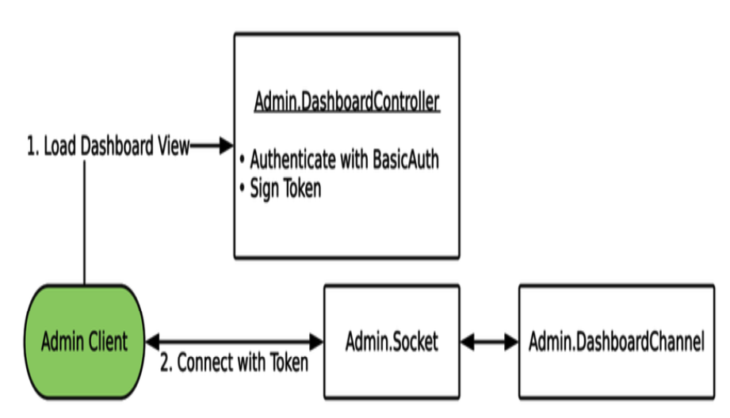
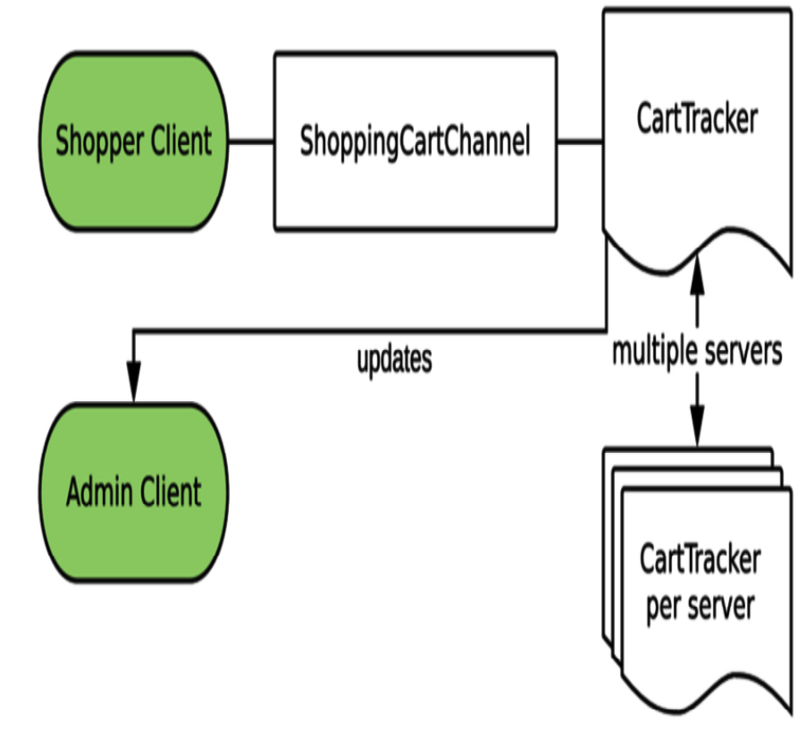
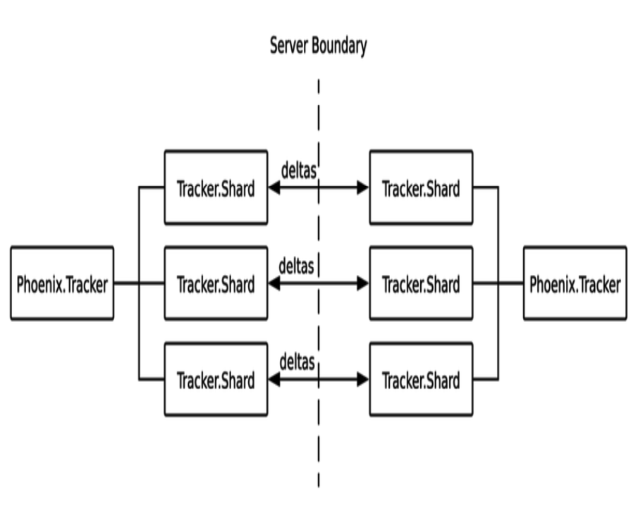
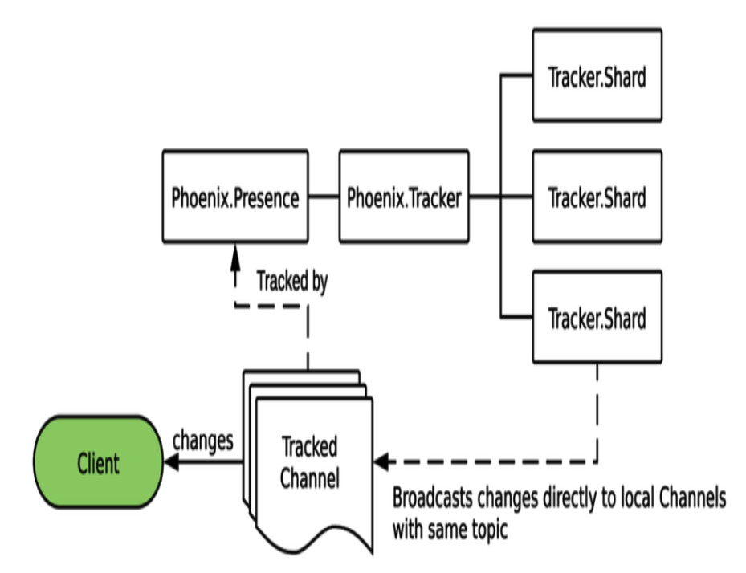

# Real-Time Phoenix 10. Track Connected Carts with Presence

## By: hanzhupeng@gmail.com

构建一个管理后台,实时显示网站当前连接的用户.使用 Phoenix Tracker 和 Presence.

分布的状态是一个困难的问题,Phoenix Tracker让分布的进程列表管理较为容易.Tracker使用了一个高级的数据结构,在集群里高效准确的分布状态, 这让我们可以知道当前有多少Channel连接. 这个问题比较难处理,Tracker帮我们做到了.

这章最重要的功能是实现当前活跃的购物者用户列表.

## 规划Admin后台

### 需求

- 所有购物者的数量(去重)
- 购物者共打开多少页面
- 购物车中的商品数量
- 权限控制,限定管理员使用

### 把需求转化成计划

用一个专门的 Socke他给管理后台使用，增强安全性。



Admin.DashboardController 负责认证和 Phoenix.Token 的创建。客户端用这个Token来连接到 Admin.Socket 。Admin.Socket 只允许管理员连接，因此后面的Channel就不需要加入topic的认证了。

用 Tracker 来知道当前有多少购物车连接。每一个 ShoppingCartChannel 在连接时都会在 CartTracker 中 track跟踪自己。



CartTracker 来跟踪所有的客户端的购物车Channel，更新给 Admin客户端，并在多个服务器之间同步。

### 设置项目工程

略

### 用 Phoenix Tracker 来 Track

Phoenix Tracker 解决集群服务器之间多个进程的跟踪问题，这看上去简单，但是因为服务器之间复制信息的冲突会变得很困难。我们用 Tracker 来跟踪每一个连接的 ShoppingCartChannel 进程，以及每一个购物车的元数据。

#### Phoenix Tracker 的设计

Tracker 使用一个特殊的数据类型来跨集群复制信息。我们将研究这个数据结构，看看它提供了什么样的保证。

Phoenix Tracker 在集群跨多态服务器之间，保持一个精确的准时的在场列表。它不使用一个单一可信数据源（如数据库），每一个服务器都贡献已知状态。在遇到分布式状态时，时间不是我们的朋友，它让这个问题充满了挑战。分发状态的状态的改变，很容易遇到各种边际情况。冲突的数据，丢失的更新，低效率等。Phoenix Tracker 使用 CRDT (Conflict-free Replicated Data Type)。

CRDT在多个服务器之间复制状态，用独立的、并发的更新底层的数据，不需要请求其他的copy用于保证。CRDT有很多种类型，Phoenix Tracker用的是 ORSWOT (Observe-Remove-Set-Without-Tombstones)管理它的状态。（本书没有深入讲解这个数据结构的实现细节，拿来用就好）

Tracker 的进程结构：



Phoenix.Tracker 模块是一群 Tracker.Shard 进程的 facade 门面接口。我们调用 Phoenix.Tracker 模块的函数，实际的数据由底层的shard 分片进程提供。这样设计避免了单进程的性能瓶颈。（跟数据库分库分表读一样）。Tracker 根据它跟踪的topic 字符串来进行分片，所以一个topic连接多个进程依然会遇到单进程的性能瓶颈。

每一个 Tracker.Shard 进程收集它自己状态的改变，然后通过 Phoenix PubSub广播到集群里其他的结点上。状态分布广播可以配置一个延迟时间来批量发送，不超过两秒钟。这使得Tracker 是最终一致性的，写操作不会立即反映到整个集群。

#### 在管理后台上使用 Phoenix Tracker

Tracker 最早用来在一个聊天app里用来实现“谁在线？”这样的问题，每个用户的Channel连接时进行跟踪，记录一些元数据，如他们的名字、uid。聊天室的每个客户端，实时的收到在线状态列表更新。后面看到如何用Presence(一个特殊类型的Tracker)来解决这个问题。

每一个 ShoppingCartChannel 在连接时会被跟踪，管理员可以看到谁在线。我们把一些元数据放到tracker里，这样就能知道各个购物车里有什么。Admin Dashboard会实时的汇集展示这些信息。

> Tracker in a Pipeline
> Tracker不止用于用户相关的场景，Tracker在数据流水线里也很有用。数据流水线在获取数据时经常消耗很大，要访问数据库或第三方的API，在调用数据访问前，我们可以先用Tracker来回答“谁在线？“

### 在应用程序中使用Tracker

创建一个模块来实现 Phoenix.Tracker behaviour，这个模块隐藏Tracker的函数调用，提供一个简单的接口。当我们需要的Channel进程join的时候进行跟踪。最后用 Phoenix.Tracker.list/2 函数来获得所有跟踪的数据。

Tracker 的样板代码如下，启动一个Tracker的 supervisor后，它启动一组 Phoenix.Tracker.Shard 进程。init/1 函数会在每个 Shard进程启动时调用，需要提供 pubsub_server key，否则Tracker将 crash。

```elixir
defmodule HelloSocketsWeb.UserTracker do
  @behaviour Phoenix.Tracker

  def child_spec(opts) do
    %{
      id: __MODULE__,
      start: {__MODULE__, :start_link, [opts]},
      type: :supervisor
    }
  end

  def start_link(opts) do
    opts =
      opts
      |> Keyword.put(:name, __MODULE__)
      |> Keyword.put(:pubsub_server, HelloSockets.PubSub)

    Phoenix.Tracker.start_link(__MODULE__, opts, opts)
  end

  def init(opts) do
    server = Keyword.fetch!(opts, :pubsub_server)
    {:ok, %{pubsub_server: server}}
  end
end
```

Tracker 需要实现一个 handle_diff/2 函数，这是用来放状态更新逻辑的地方。

```elixir
  require Logger
  def handle_diff(changes, state) do
    Logger.info inspect({"tracked changes", changes})
    {:ok, state}
  end

  def track(%{channel_pid: pid, topic: topic, assigns: %{user_id:   user_id}}) do
    metadata = %{
      online_at: DateTime.utc_now(),
      user_id: user_id
    }
    Phoenix.Tracker.track(__MODULE__, pid, topic, user_id, metadata)
  end

  def list(topic \\ "tracked") do
    Phoenix.Tracker.list(__MODULE__, topic)
  end
```

Phoenix.Tracker.track/5 是最重要的调用，它给定pid 和 topic。可以添加任意的元数据metadata，可以用来记录”谁“，”什么时候”joined的。

把 UserTrack加入到应用的监督树里：

```elixir
    children = [
        #....
      HelloSocketsWeb.Endpoint,
      {HelloSocketsWeb.UserTracker, [pool_size: :erlang.system_info(:schedulers_online)]}
    ]
```

Tips:

> Tracker 基于Topic来分片，因此相同topic的消息最终会是同一个进程来处理，在大量消息的情况下，还是可能会有性能瓶颈。

接下来创建新的TrackedChannel， 并在socket中添加路由。

```elixir
defmodule HelloSocketsWeb.TrackedChannel do
  use Phoenix.Channel

  alias HelloSocketsWeb.UserTracker

  def join("tracked", _payload, socket) do
    send(self(), :after_join)
    {:ok, socket}
  end

  def handle_info(:after_join, socket) do
    {:ok, _} = UserTracker.track(socket)
    {:noreply, socket}
  end
end
```

注意这里的 send(self(), :after_join) ，能快速的进行响应，然后异步的进行处理。这是elixir/erlang 里的惯用方法。

在前端 socket.js 里添加上 socket 和 channel相关的代码：

```js
const trackedSocket = new Socket("/auth_socket", {
  params: { token: window.authToken }
})
trackedSocket.connect()

const trackerChannel = trackedSocket.channel("tracked")
trackerChannel.join()
```

实际测试，打开一个 app 结点，一个back 结点，用 Node.connect 组成集群。
在浏览器上打开 http://localhost:5200/tracked?user_id=1
在 back结点上：

```elixir
iex(back@127.0.0.1)7> Node.connect(:"app@127.0.0.1")
true
iex(back@127.0.0.1)8> HelloSocketsWeb.UserTracker.list()
[]
iex(back@127.0.0.1)9> HelloSocketsWeb.UserTracker.list()
[]
iex(back@127.0.0.1)10> Node.list()
[:"app@127.0.0.1"]
iex(back@127.0.0.1)11> [info] {"tracked changes", %{"tracked" => {[{"1", %{online_at: ~U[2020-08-18 09:10:01.326849Z], phx_ref: "t3ileu4tEOc=", user_id: "1"}}], []}}}
 
nil
iex(back@127.0.0.1)12> 
nil
iex(back@127.0.0.1)13> HelloSocketsWeb.UserTracker.list()
[
  {"1",
   %{
     online_at: ~U[2020-08-18 09:10:01.326849Z],
     phx_ref: "t3ileu4tEOc=",
     user_id: "1"
   }}
]
```

尝试用不同的 user_id 参数打开多个tab，关闭其中的几个，可以看到 tracked changes 的 log信息， UserTracker.list() 的结果也会响应改变。Tracker把他的状态分布到整个集群上。

当 app结点关闭时， back结点上需要过一会改变状态。
当 app结点重启时，back结点需要重新 connect 一下，然后整个crdt 结构会全部重新发送：

```elixir
iex(back@127.0.0.1)56> Node.connect(:"app@127.0.0.1")
true
iex(back@127.0.0.1)57> [debug] {:"back@127.0.0.1", 1597741829729266}: falling back to sending entire crdt
```

在各个场景下，Tracker总能最终显示正确，但它可能会用一些时间（最多30秒），大部分改变感觉上立刻能生效。

handle_diff/2 函数在各个节点上都执行，你可以在里面做任何事情。

## Phoenix Tracker 与 Presence

Phoenix Presence 是 Tracker的一个实现，它为处理 Channel 提供了一些辅助函数。在它的 handle_diff/2 函数实现里，当一个进程加入或离开Tracker时，它在本地将更新用 PubSub进行广播。客户端通过监听这些改变消息，在客户端侧保持一个Tracker的状态。官方 Phoenix 的JavaScript库里，包含了 Presence 库来自动处理这些消息。



### 注意

Tracker 和 Presence 库很像，所以可能在选择时感到迷惑。如果你需要把某个topic所有的改变都广播给客户端，那么用  Presence。如果你想控制如何处理那些diff，或者不想把改变广播给客户端，那么用  Tracker。

即使你的客户端不处理Presence 的消息，Presence依然会发送消息。需要确认这是否是需要的行为，避免发送给不正确的客户。在浏览器的开发者工具窗口，检查 WebSocket的通讯。

在这里我们给 admin 界面使用 Presence，因为我们想实时更新管理界面。我们不想让购物者收到这些更新。因此我们对 Presence 跟踪的topic要小心处理。

## 搭建 Admin Dashboard

1. 定义新的 Router 路由项目
2. 设置 admin 布局 layout
3. 创建 Admin.DashboardController
4. 创建 Admin.Socket 和 Admin.DashboardChannel
5. 创建 admin js css

### 1. 定义新的 Router 路由项目

创建基本的登录验证，在mix.exs 里增加 basic_auth 库，在 config里增加admin的密码。

在 Router 里设置 admin 的 pipeline，将 /admin 路径置于 BasicAuth 之后：

```elixir
  scope "/", Sneakers23Web do
    pipe_through :browser

    get "/", ProductController, :index
    get "/checkout", CheckoutController, :show
    post "/checkout", CheckoutController, :purchase
    get "/checkout/complete", CheckoutController, :success
  end

  pipeline :admin do
    plug BasicAuth, use_config: {:sneakers_23, :admin_auth}
    plug :put_layout, {Sneakers23Web.LayoutView, :admin}
  end

  scope "/admin", Sneakers23Web.Admin do
    pipe_through [:browser, :admin]

    get "/", DashboardController, :index
  end
```

### 2. 设置 admin 布局 layout

copy 下。

### 3. 创建 Admin.DashboardController

```elixir
defmodule Sneakers23Web.Admin.DashboardController do
  use Sneakers23Web, :controller

  def index(conn, _params) do
    {:ok, products} = Sneakers23.Inventory.get_complete_products()

    conn
    |> assign(:products, products)
    |> assign(:admin_token, sign_admin_token(conn))
    |> render("index.html")
  end

  defp sign_admin_token(conn) do
    Phoenix.Token.sign(conn, "admin socket", "admin")
  end
end
```

创建admin 的dashboard 页面模板，以及 View 模块。

### 4. 创建 Admin.Socket 和 Admin.DashboardChannel

Endpoint里添加 Admin.Socket 。 Admin Socket与之前做的 AuthSocket 一样

```elixir
  socket "/admin_socket", Sneakers23Web.Admin.Socket,
    websocket: true,
    longpoll: false
```

Socket 里定义 channel 的路由：

```elixir
  ## Channels
  channel "admin:cart_tracker", Sneakers23Web.Admin.DashboardChannel
```

添加基本的 Sneakers23Web.Admin.DashboardChannel 模块

```elixir
defmodule Sneakers23Web.Admin.DashboardChannel do
  use Phoenix.Channel

  def join("admin:cart_tracker", _payload, socket) do
    {:ok, socket}
  end
end
```

### 5. 创建 admin js css

修改 webpack.config.js ， 添加 admin.js 的配置。

```js
import { Presence } from 'phoenix'
import adminCss from '../css/admin.css'
import css from "../css/app.css"
import { adminSocket } from "./admin/socket"
import dom from './admin/dom'

adminSocket.connect()

const cartTracker = adminSocket.channel("admin:cart_tracker")
const presence = new Presence(cartTracker)
window.presence = presence // This is a helper for us

cartTracker.join().receive("error", () => {
  console.error("Channel join failed")
})
```

定义 admin/socket.js

```js
import { Socket } from "phoenix"

export const adminSocket = new Socket("/admin_socket", {
  params: { token: window.adminToken }
})
```

脚手架建完了，下面用 Phoenix Presence 来实现 CartTracker。

## 实时跟踪购物车

我们用 Presence 来跟踪每一个 ShoppingCartChannel 以及每个购物者的购物车里的项目id列表。购物车里的每个改变，都会分发一个 update给 CartTracker，admin 客户端自动收到这些更新。

1. 用 Phoenix.Presence 创建一个 CartTracker 模块
2. ShoppingCartChannel 连接到 CartTracker
3. 购物车的更新发送给 CartTracker
4. 配置 admin.js 来接收 Presence 的更新
5. 在管理界面聚合并显示这些信息

### 1. 用 Phoenix.Presence 创建一个 CartTracker 模块

```elixir
defmodule Sneakers23Web.CartTracker do
  use Phoenix.Presence, otp_app: :sneakers_23,
      pubsub_server: Sneakers23.PubSub

  @topic "admin:cart_tracker"

  def track_cart(socket, %{cart: cart, id: id, page: page}) do
    track(socket.channel_pid, @topic, id, %{
      page_loaded_at: System.system_time(:millisecond),
      page: page,
      items: Sneakers23.Checkout.cart_item_ids(cart)
    })
  end

  def update_cart(socket, %{cart: cart, id: id}) do
    update(socket.channel_pid, @topic, id, fn existing_meta ->
        Map.put(existing_meta, :items, Sneakers23.Checkout.cart_item_ids(cart))
      end)
  end

  def all_carts(), do: list(@topic)
end
```

这里加入的 topic 与ShoppingCartChannel 的topic不同，这样购物者就不会收到Presence 的更新了。

all_carts 函数，使用 Presence 里的 list 方法，这里可以用自定义的排序方式。
update/4 函数的最后一个参数，可以是一个 metadata的map，也可以是一个返回新metadata的函数。

在 Application 里将 CartTracker 放到进程树里。

### 2. ShoppingCartChannel 连接到 CartTracker

修改 ShoppingCartChannel

```elixir
  def join("cart:" <> id, params, socket) when byte_size(id) == 64 do
    cart = get_cart(params)
    socket = assign(socket, :cart, cart)
    send(self(), :send_cart)
    enqueue_cart_subscriptions(cart)

    socket = socket
      |> assign(:cart_id, id)
      |> assign(:page, Map.get(params, "page", nil))
    send(self(), :after_join)

    {:ok, socket}
  end
  def handle_info(:after_join, socket = %{
      assigns: %{cart: cart, cart_id: id, page: page}
    }) do
    {:ok, _} = Sneakers23Web.CartTracker.track_cart(
      socket, %{cart: cart, id: id, page: page}
      )

    {:noreply, socket}
  end
```

在 join 的时候，调用 CartTracker 的 track_cart 方法，将本 Channel 加入进去。

在 handle_out("cart_updated"...) 以及 broadcast_cart 里发出:update_tracked_cart 事件

```elixir
    send(self(), :update_tracked_cart)
```

```elixir
  def handle_info(:update_tracked_cart, socket = %{
    assigns: %{cart: cart, cart_id: id}
  }) do
    {:ok, _} = Sneakers23Web.CartTracker.update_cart(
      socket, %{cart: cart, id: id} )
    {:noreply, socket}
  end
```

Presence 的工作原理是发给客户端一个初始的数据，然后推送更新来让客户端的数据保持同步。因此需要在 Admin.DashboardChannel 里发送初始的状态。

```elixir
defmodule Sneakers23Web.Admin.DashboardChannel do
  use Phoenix.Channel

  def join("admin:cart_tracker", _payload, socket) do
    send(self(), :after_join)
    {:ok, socket}
  end

  def handle_info(:after_join, socket) do
    push(socket, "presence_state", Sneakers23Web.CartTracker.all_carts())
    {:noreply, socket}
  end
end
```

我们有一个需求是要知道我们站点每个页面上有多少用户，我们可以通过 productChannel join时跟踪路径 pathname：

cart.js:

```js
function channelParams() {
  return {
    serialized: localStorage.storedCart,
    page: window.location.pathname
  }
}
```

## 装配 Admin Dashboard

最后一步，把 Presence 的状态完整的在页面上显示。

templates/admin/dashboard/index.html.eex

测试，在浏览器里，分别打开 admin 页面和首页。可以看到 Admin 页面下的 WebSocket 里的数据流。

presence.state 数据里包含了所有的cart 的元数据，列表大小，就是当前在线的购物车的数量。
在 Presence 同步时， 调用 onSync ，分别对在线用户数量，各个页面人数，各个商品的数量进行统计和页面显示更新。
(这些统计，在服务端实现可能更方便（因为是Elixir)，然后通过其他的Channel 来给出结果，而不是用 Presence）

admin.js

```js

presence.onSync(() => {
  dom.setShopperCount(getShopperCount(presence))
  dom.assemblePageCounts(getPageCounts(presence))

  const itemCounts = getItemCounts(presence)
  dom.resetItemCounts()
  Object.keys(itemCounts).forEach((itemId) => {
    dom.setItemCount(itemId, itemCounts[itemId])
  })
})

function getShopperCount(presence) {
  return Object.keys(presence.state).length
}

function getPageCounts(presence) {
  const pageCounts = {}
  Object.values(presence.state).forEach(({ metas }) => {
    metas.forEach(({ page }) => {
      pageCounts[page] = pageCounts[page] || 0
      pageCounts[page] += 1
    })
  })
  return pageCounts
}

function getItemCounts(presence) {
  const itemCounts = {}
  Object.values(presence.state).forEach(({ metas }) => {
    metas[0].items.forEach((itemId) => {
      itemCounts[itemId] = itemCounts[itemId] || 0
      itemCounts[itemId] += 1
    })
  })
  return itemCounts
}
```

## Admin Dashboard 的压力测试

当有大量用户连接时，我们的 Admin界面性能如何需要测试。

我们用 Elixir 来模拟客户端的连接，进行压力测试。

读下随书示例代码 sneaker_admin_bench。这里用到一个开源库 PhoenixClient 来连接我们的 Socket 和 Channel，它模仿 Phoenix.Socket 和 Phoenix.Channel 的API，给我们提供了与Socket/Channel交换数据的一个简单的方法。

代码：

```elixir
defmodule SneakerAdminBench do
  @moduledoc """
  启动多个 Shopper连接，每一个连接join进一个CartChannel，并加入随机的项目
  """

  def start_connections(chunks \\ 10) when chunks > 0 and chunks <= 50 do
    Enum.each(1..chunks, fn _ ->
      Enum.each(1..100, fn _ -> SneakerAdminBench.Shopper.start([]) end)
      Process.sleep(100)
    end)
  end
end
```

Shopper:

```elixir
  def handle_continue([], state) do
    {:ok, socket} = PhoenixClient.Socket.start_link(@socket_opts)
    send(self(), :connect_channel)
    {:noreply, Map.put(state, :socket, socket)}
  end
  def handle_info(:connect_channel, state = %{socket: socket, connect_count: count}) do
    if PhoenixClient.Socket.connected?(socket) do
      {:ok, _response, channel} = PhoenixClient.Channel.join(
        socket,
        "cart:#{generate_cart_id()}",
        %{page: "/bench/#{:rand.uniform(4)}"}
      )

      state = Map.put(state, :channel, channel)

      {:ok, _message} = PhoenixClient.Channel.push(
        channel, "add_item", %{item_id: random_item_id()}
      )

      {:noreply, state}
    else
      Process.send_after(self(), :connect_channel, @connect_wait)
      {:noreply, %{state | connect_count: count + 1}}
    end
  end
```

模仿客户端的WebSocket 操作。

