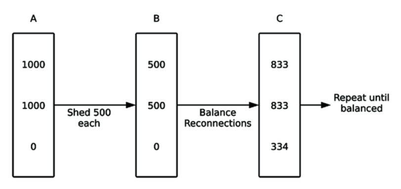

# Real-Time Phoenix 11. 部署应用到生产环境

## By: hanzhupeng@gmail.com  2020/08/18

本章讨论生产环境下，实时应用的部署与监控。

- 不同的部署方式，
- WebSocket的负载均衡
- 代码更新策略
- BEAM结点的集群选项

部署涉及到很多问题，可能开始会被吓到，不过部署过之后，后续就简单了。

## The Lay of the Land

首先浏览下当前Elixir应用部署的现状。

### Mix, RELEASES, Distillery

用 mix phx.server 启动本地的服务器时最简单的方法，可以在生产环境运行你的应用。但是它比 release 少一点特性。

用mix 的另一种方法是把应用打包成一个 release。有两个工具 Mix Release 和 Distillery。Distillery存在的时间久一些，比Mix Release多一点特性，不过你可能不需要。

Elixir社区普遍用 Release 来部署，你最好也这样。有一些好处是 mix phx.server 或 mix run 没有直接提供的：

- 自包含的包，应用和 BEAM Erlang运行时打包在一起，因此部署的机器上不需要安装特定的软件。并且发布的是编译后的文件，而不是源代码。
- 管理脚本，免费提供了一组脚本，可以用来连接交互环境到运行的服务器，执行远程调用，用守护进程的方式执行你的应用，等
- 定制化启动，可以简单的定制化BEAM的启动，可以设置 BEAM启动的 flag参数，来调整BEAM的行为。
- 代码预加载，在release模式代码是在启动时全部加载的，而不是按需加载的。

这些好处 Mix Release 和 Distillery 都提供，因此可以用其中任意一个。其中一些特性，如管理脚本对操作生产环境的应用很重要。

后面有个例子，可以通过shell inspect 检查一个运行中的应用，这对于调试生产环境运行中的应用非常有用。（类似Common Lisp， clojure的远程REPL）

### 部署的平台与工具

可以用PaaS来帮你搞定，也可以用私有主机自己管理系统和应用。

> 作者工作中如何部署应用
> Kubernetes 和 Docker
> Dockerfile 使用 Distillery 创建应用的 release，然后用 Docker的 multi-stage build流水线，创建干净的Docker image，只包含操作系统和编译后的release
> 用远程交互shell，可以方便的查找问题
> Docker 和 Kubernetes 与 BEAM不能替换彼此，他们互补。

用PaaS服务时，要注意，Elixir 的实时应用，需要大量的并发连接。WebSocket 是长连接，一些云服务提供商不支持大量的长连接。另外看是否支持 BEAM集群。

Elixir社区两个重要的PaaS支持上面这些需求： Gigalixir 和 Render。

## 通过负载均衡获得可扩展性

生产环境上应用至少要有两个服务器来做负载均衡，这样一个服务器重启，服务依然可用。一个均衡良好的集群，各个节点获得的访问量压力应该是均匀的。还可以让一个负载均衡的集群里添加新的服务器，来降低集群中其他服务器去的压力。

### 负载均衡基础

负载均衡是一个专用的软件，它在客户端与服务器之间扮演一个proxy代理。请求，通过round-robin、最小连接、或自定义的标准，来发给后端的服务器。可以快速的加减服务器，公平的分发任务，增加冗余。

大部分云服务厂商提供了开箱即用的负载均衡服务。还可以选择开源的如 HAProxy, nginx。

现在大部分负债均衡器都支持 WebSocket，不过有些还是需要运行在如“TCP only”模式下，让代理不去尝试解释或改变请求。

负载均衡器依赖于web请求的无状态和短连接，来进行公平的分布。用户访问一个URL，可能被发送给服务器A，然后做另一个请求时立刻被发送给服务器B。这个过程是无缝的，用户无感。在处理持久的连接如WebSocket时，会有些麻烦。

### WebSocket 与负载均衡

想象一个场景，你的应用有两个服务器，每个上面都运行了一段时间，有1000个活跃的WebSocket连接，他们现在是均匀的。

当压力过大时，你添加了第3台服务器。它上线了，但是没有 WebSocket连接。这种情况下，新增加的能力没有起效果。因为是持久化的连接，除非网络断了或应用重启，才会重连。负载均衡器，可以使用最小连接方式分配，让新的连接都到新的服务器上，但是现有的服务器依然保持高负载，直到连接关闭。

不幸的是，没有一个优雅的解决方案。新添加的服务器，需要让其他服务器的客户断开连接，然后连到新的服务器上。这需要定制的配置。

应用层面有解决的方案，一个简单的访问是让老的服务器断开客户的连接，然后让新服务器接手。当有多个服务器时，新服务器经常是随机被选中的。

如下面的方案，开始每个老服务器干掉一半的连接，然后重新连接后就平衡一点了。但这里，干掉的那些只有1/3 进了新服务器。



另一种方案，一个应用根据某关键资源的使用情况（如CPU，内存），到一定程度就干掉一些连接。

最后一种简单的方案，周期性的关闭一些WebSocket的连接。简单易行，不过可能需要一些时间，客户端也会在整个活动期间经常重连。

等到达到一定瓶颈时，选用特定的方案解决。

## 安全的发布新代码

更新代码，发布更新。很多时候选择在下班没人的时候，我们看看如何能在任意时候发布代码，而不打断用户使用。

两种策略：滚动部署，blue-green 部署。

### 部署的现实情况

部署更新，会重启服务器，所有的连接会断开，客户端会停止响应一段时间，服务器进程里的数据或ets表会丢。

Elixir支持热代码重载，这可以让你在系统运行时更新代码。但是，这要尽量避免使用，最好不用。需要保证数据结构和GenServer能在线迁移，有太多的复杂性产生。这些复杂性导致的错误部署，会强迫你重启所有的服务器。

### Rolling Deployments 滚动部署

一种最简单的部署方式。滚动部署对大多数的应用都管用。对短连接请求的应用管用，但是WebSocket会遇到问题。第一个重启的服务器，在部署后，会被分配最多的流量。（一般问题不大）

### Blue-Green Deployments

更新时，先准备好新的集群，然后批量的把老的切换过去。这样新的连接较为平衡。（但这样需要一组多的服务器，用云服务或虚拟机倒是可行）。

## Cluster Your BEAM Nodes Together，将BEAM结点组成集群

我们需要让生产环境下的BEAM结点都连接在一起，这样PubSub的消息才能分布到各个节点上。有两种连接的方法：一种是用 OTP提供的用分布式Erlang连接结点，这在一个集群里所有的结点建立点对点的连接。但是有些部署环境，由于网络连接的限制，无法使用这种连接方式。在这种情况下，可以用Redis作为替代集群方案。

### 让应用为集群做准备

Elixir/Erlang 里我最喜欢的一点，就是开箱即用的结点到结点的连接性支持。

:net_kernel.connect_node/1 函数连接到远程的node结点，一旦TCP连接建立，系统通过心跳保持连接，并在无应答时自动断开。但是需要注意一些事情：

1. 要连接结点，首先需要给 BEAM结点一个给定的端口和IP。你可以硬编码BEAM使用的端口，或者使用 epmd: Erlang Port Mapper Daemon 在远程节点之间运行。epmd 将节点名字符号映射成机器地址，这样程序里可以使用 :my_app@my_host ，然后别映射成正确的端口和IP地址。*epmd 永远都不能暴露在公网上，只能用于集群的结点之间*。

2. 集群里的所有结点需要共享一个cookie。Mix Release 和 Distillery 自动做了设置。

《Adopting Elixir》讨论的更加详细，关于分布式erlang,epmd, SSL 和 cookie。用 release 大部分会自动处理。

### 集群所用的库

要连接两个节点非常简单： Node.connect(:"server@127.0.0.1") 就可以将两个节点炼器来。挑战是如何确定需要连哪些节点，以及它们在哪。在本地服务发现Discovery是一个简单的任务，因为你啥都知道。但在生产环境，你的结点将分布在多个物理服务器及IP地址下。甚至在完全不同的数据中心。

有两个库来解决结点的发现问题： Peerage 和 libcluster 。最简单的方法是，把结点的名字手写在配置文件里。你可以使用更强大的特性，如基于DNS的发现，Kubernets API 发现，或者自己写一个服务发现服务策略。

libcluster 是个强大的工具，但是由于网络限制，可能无法使用分布式Erlang。

### 基于Redis 的PubSub ，集群的替代方案

Phoenix的Channel是构建在 PubSub上的，它对实际的通讯方式进行了抽象。因此当由于某些原因无法使用Erlang集群时，可以用 phoenix_pubsub_redis 来进行通讯。以防万一。

注意使用 Redis PubSub实现时，所有的消息都发送到一个Redis服务器上，可能造成网络带宽的峰值。因此需要对Redis的服务器进行监控。

基于Redis的PubSub并不是分布式Erlang的完整替代，使用它的应用不能使用原生的分布式功能，也无法与其他节点直接连接。Phoenix.Channel 在其上是直接可用的，其他需要的特性可以基于Channel来实现。

## Advanced Phoenix Channel Configuration

读文档：[Phoenix Release Guide](https://hexdocs.pm/phoenix/releases.html)

### Origin Checking

基于Channel的应用有个特定的配置需要注意： Origin checking。

Origin Checking是一个安全考虑，它限制哪个web站点可以连接到你的应用。对Channel的连接，检查Origin HTTP header，确保它在允许的列表内。默认的，唯一允许的origin是应用配置里的 host配置项，如下面的配置只允许 "app.sneakers23.com" host。

```elixir
 config :sneakers_23, Sneakers23Web.Endpoint,
   url: [host: "app.sneakers23.com", port: 80]
```

也可以通过配置关闭 check_origin。

可以对所有的socket改变配置，也可以针对每个socket。

```elixir
socket "/socket", MyStoreWeb.ProductSocket,
  websocket: [
    check_origin: {MyStoreWeb.Origin, :allowed?, []}
  ]
```

这个配置将调用 MyStoreWeb.ProductSocket.allowed?(uri)，来检查uri 的origin。它返回 true 或 false。

### 其他配置项

connect_info 配置项，可以让 Phoenix.Socket.connect/3 回调收到附加的信息，用来决定连接是否被接受。

设置 compress: true 可以压缩WebSocket的通讯，可以省点带宽，但会增加服务器和客户端的CPU使用。

可以设置每个WebSocket frame的最大尺寸。如果从客户端来的payload是动态的时候，这很有用。
