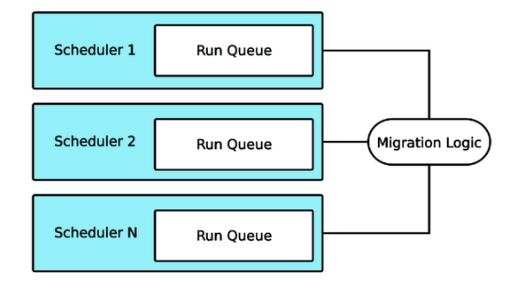
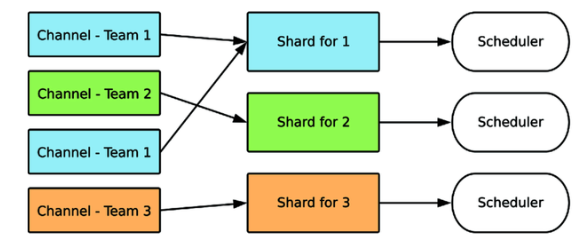
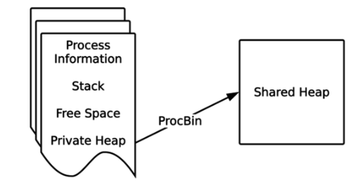
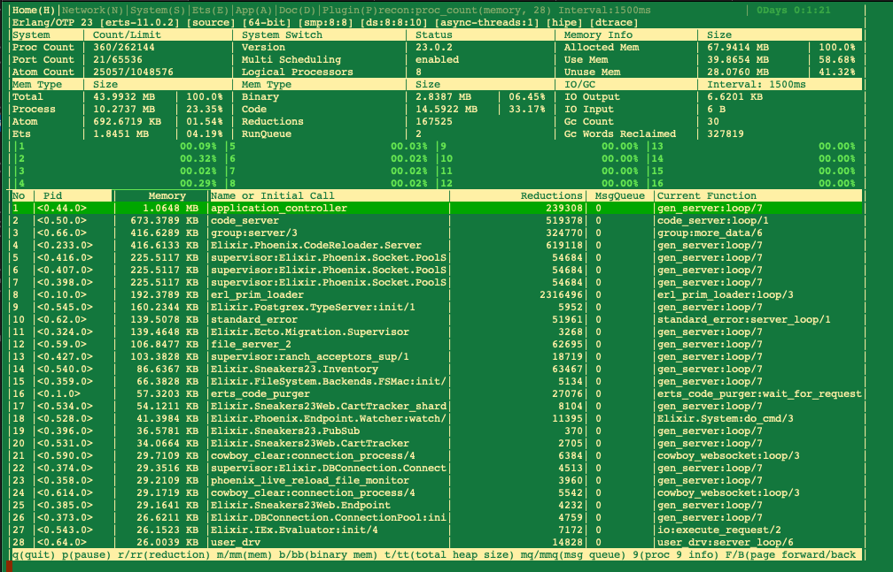

# Real-Time Phoenix 12. Manage Real-Time Resources

## by: hanzhupeng@gmail.com 2020-8-19

本章讨论BEAM管理的系统资源，与传统应用相比，实时应用的需求。

运行应用有两个主要的资源：CPU和内存。你讲看到BEAM如何使用这些资源，以及如何构建应用来最好的使用这些可用资源。BEAM是个很稳固的虚拟机，但是在部署高容量应用时，你要了解它是如何调度以及如何使用内存的。

我们从BEAM如何运作开始，你会看到Scheduler调度器如何工作，应用如何高效的利用系统的CPU。之后研究下BEAM如何分配及垃圾回收内存。最后我们会看到如何inspect检查一个生产系统如何使用它的资源。

## 熟悉Elixir调度器

应用的角色是把任务做完，写代码运行在CPU上。不同的语言体验不同，有些语言需要你对任何事给明确的指示，你可以完全控制，但也容易出错。另一些语言拿走控制权，你可以容易的使用，并且较为稳定。Elixir属于易用稳定那一拨的，但它的虚拟机，有一个适合软实时应用的调度器。

调度器是用来在各种资源（如CPU）间分配任务的方法。

### Elixir的调度器设计（应该说是Erlang的吧）

一些关键概念：任务如何分片执行在CPU上；在执行CPU密集型代码时如何保证系统不会完全的冻住。

一些术语：

- Scheduler 调度器：调度器选取一个进程，并执行这个进程的代码
- Run Queue 执行队列：需要执行的一组进程列表，一个进程只存在与一个执行队列。
  
#### 任务如何调度

先看一个最简单的情况，含有一个单独执行队列的单调度器。

Scheduler 1 -> Run Queue

这是最简单的模型，队列里最老的任务接下来执行在单独一个CPU 内核上。不需要担心软件lock和硬件分布问题。但是有些问题，最大的问题是无法利用多核CPU的优势。

多调度器，单执行队列，可以让应用在多CPU核上运行。可以利用多核，但是需要锁，引入更多的调度器会造成更大的性能瓶颈。

下图是BEAM当前使用的模型，多调度器，每一个包含各自的执行队列，还有一个迁移逻辑，来更好的在多个核之间进行负载均衡（work stealing）。最后结果是每个核都能有效利用，并减少锁。



#### 任务如何执行

CPU密集型的工作如何执行，而不让整个应用停止响应。

在一些语言里容易困在死循环里，无论等多久，系统都不会退出循环，必须用外部的信号来杀死它。BEAM不会困在一个无限循环里。

BEAM有一个抢先式调度器，它可以把当前正在执行的任务换出去，让其他需要执行的任务开始执行。这与协同式调度器不同，使用协同式调度器，运行的代码需要把控制流明确的释放回调度器。（Windows95与Windows3的区别）

抢先式调度不是魔法，需要有一个任务可以停止的clean break（安全干净的停止）。在BEAM里，clean break在函数执行之后。在实际使用中有效，因为函数一般不会执行大量的CPU密集型任务，而不调用其他的函数。

BEAM会记录一个进程调用一个函数后执行了多少工作，通过增加一个reduction（规约）计数器。经过一定量的reduction后，进程将被强占并放到执行队列的末尾，其他进程开始执行。这个抢占式的过程阻止了单独进程霸占全部的CPU内核，那会把其他进程饿死。

实际看下，我们定义个递归函数，它无限循环。我们启动多个这样的递归函数，这样每一个调度器都会繁忙。我们看到新的任务依然可以被BEAM执行。

这里有个例外情况，因为有可能执行 NIF （Native Implemented Function)。NIF不能抢先调度，因为它在Eralng的函数式范式之外执行。这意味着调度器有可能在NIF调用时被占用太久，这回造成VM的不稳定性。有个新的调度器类型（dirty scheduler），可以让更慢的NIF在其上运行。

### 实时应用里的CPU

Elixir里的实时应用与非实时应用，在CPU使用上相似。可能遇到最大的性能问题，是单进程瓶颈。当应用里有多个进程同时请求一个进程时，（如Channel）瓶颈可能出现。进程每次处理一个消息，其他全部的消息都要等待这个消息处理完，这会导致响应变慢。

避免单进程瓶颈的一个方法是对进程分片，基于key或其他的条件。（类似于数据库分库分表）。有了多个进程后，调度器就可以在多个核上分配执行。如果只有单独一个进程，就只能利用一个核。



Phoenix Tracker把它的CRDT进程，分割成多个分片，数量可以配置。通过把key 进行哈希映射到一个分片进程上。

没有办法完全的避免应用中的执行瓶颈，后面介绍inspect一个执行中的应用，来定位繁忙进程瓶颈。

### 高效管理应用的内存

降低内存使用不会带来性能的巨大提升，但能用更少的服务器给更多的用户使用。可以用一些简单的技术来极大的降低内存使用问题。

最重要的是内存的分配与gc垃圾回收。Elixir没有一个基金的垃圾回收器，但与其他语言相比有一些关键不同。

#### Elixir的垃圾回收设计（应该说是Erlang的吧）

垃圾收集GC是程序运行时自动进行内存管理的过程。通过回收不使用的内存来防止应用占用太多的内存。收集时让内存重新可用或归还操作系统。BEAM将保留一点额外的内存，而不是直接归还系统，这可以提升一点分配速度。

内存管理是个很深入的话题，这里只讲一些概要。

每一个BEAM的进程有它自己的栈和堆（stack, heap)，用于小的二进制数据（小于64字节）。更大的二进制数据存储在共享的内存空间里，带有一个引用计数器（ProcBin），引用计数存在与进程的heap堆里。这意味着我们的应用里有多个stack和heap，每个进程一个。这与很多其他的语言不通，他们具有单独的stack和heap。



私有的heap尺寸将会增长，最终充满旧数据。GC会执行清理进程的内存。BEAM与其他很多虚拟机不同支出在于GC发生在单个进程里，而不是全局。很多进程可以同时进行GC，只有在需要这样做时。

BEAM的进程有两种类型的GC。第一种，经常发生，称为 分代式 generational gc，也叫次级垃圾回收。它只回收新生的堆，这基于大部分内存只使用一小段时间。

第二种类型叫做 full-sweep 也叫major gc。它新老堆都会收集。它比分代式gc发生的频率低的多，它发生在堆快满的时候，这时会有一定量的gc发生，或者手动调用。实际使用中 full-sweep是快的，但是如果在一个持有大量的数据的进程上执行将会变慢。

参考文章： [深入了解Erlang 垃圾回收机制以及其重要性](https://segmentfault.com/a/1190000003758525)

#### 短生命期和长生命期进程

为什么实时应用的进程在gc上会遇到问题。

实时应用依赖于长生命期进程，它与客户端保持一个直接的连接，当数据可用时，它能立刻发给客户端。

进程可能会陷入一种状态：GC不发生，但是内存也不被使用。在有数千个进程时，会造成较为严重的内存浮肿。

> It’s possible that processes get stuck in a state where garbage collection doesn’t occur, but memory isn’t being used. This can cause large memory bloat when amplified across thousands of processes.

如果一块内存过了分代式gc，它将一直存活到一个full-sweep GC发生。默认是在65535代之后发生，或者在进程接近用光所有可用内存时。Channel,Socket 或其他长生命期的进程，会陷在这种状态里，有充足的空闲内存，但是没有足够的工作来触发分代。这时进程内存不会被收集，潜在的占用过多内存。

短生命期的进程，创建和结束很快，因此不会陷入这种状态，因为进程结束后内存就回收了。实时应用里，大量使用了长生命期的进程，因此会放大内存浮肿的冲击。

可以通过手动调用full-sweep GC或者进程休眠来解决这个问题。

#### 进程休眠避免浮肿问题

触发GC最容易的方法是把一个长时间运行的进程置于休眠状态。休眠会释放调用栈，并立刻进行GC。当一个进程在近期不会接收消息时这很有用（10-30秒）。如果在每个消息后都休眠一个进程，然后立刻又收到一个消息，应用将会做额外的工作来恢复休眠的进程。这是一个可接受的取舍。（对于不活跃的用户连接，超过一定时间将相应的进程休眠）

示例程序

```elixir
defmodule Memory do
  use GenServer

  def init([]) do
    {:ok, []}
  end

  def handle_call({:allocate, chars}, _from, state) do
    data = Enum.map((1..chars), fn _ -> "a" end)
    {:reply, :ok, [data | state]}
  end

  def handle_call(:clear, _from, _state) do
    {:reply, :ok, []}
  end

  def handle_call(:noop, _from, state) do
    {:reply, :ok, state}
  end

  def handle_call(:clear_hibernate, _from, _state) do
    {:reply, :ok, [], :hibernate}
  end
end
```

执行：

```elixir
iex(1)> {:ok, pid} = GenServer.start_link(Memory, [])
{:ok, #PID<0.165.0>}

# 获取进程的内存信息
iex(2)> :erlang.process_info(pid, :memory)
{:memory, 2836}

# 分配数据
iex(3)> GenServer.call(pid, {:allocate, 4_000})
:ok

# 内存占用
iex(4)> :erlang.process_info(pid, :memory)
{:memory, 142820}

# 清理掉进程的数据
iex(5)> GenServer.call(pid, :clear)
:ok

# 进程的内存占用并没有回收
iex(6)> :erlang.process_info(pid, :memory)
{:memory, 142820}
iex(7)> Enum.each((1..100), fn _ -> GenServer.call(pid, :noop) end)
:ok

# 执行过100次空操作依然没有GC
iex(8)> :erlang.process_info(pid, :memory)
{:memory, 142820}

# 手动执行GC
iex(9)> :erlang.garbage_collect(pid)
true

# 内存终于回收了
iex(10)> :erlang.process_info(pid, :memory)
{:memory, 2836}

# 再分配下数据
iex(11)> GenServer.call(pid, {:allocate, 4_000})
:ok
iex(12)> :erlang.process_info(pid, :memory)
{:memory, 142820}

# 调用休眠
iex(13)> GenServer.call(pid, :clear_hibernate)
:ok

# 这次直接major GC了
iex(14)> :erlang.process_info(pid, :memory)
{:memory, 1236}
```

可以在start_link 时加上一个 hibernate_after参数，可以让进程在idle一定时间后自动休眠。

Phoenix Channel使用 hibernate_after 选项，在处理完最后的消息15秒后进入休眠。这个时间可变，也可以完全禁止休眠。

自己写的长生命期的进程，需要考虑使用休眠机制。

#### 需要时手动GC

对一些休眠不管用的场景，如当进程频繁收到消息时，可以手动GC来清理内存。

用 :erlang.garbage_collect/1 函数可以传入任意进程的pid，或者不指定pid就出发本进程的GC。

对全部进程进行GC：

```elixir
iex(9)> Process.list() |> Enum.each(&:erlang.garbage_collect/1)
:ok
```

#### 调节GC发生的频率

可以定制BEAM的启动参数 flag。与内存相关的flag有很多，其中 ERL_FULLSWEEP_AFTER 改变major GC前minor GC的次数。

修改Distillery 或 Mix Release中的 vm.args 文件，调整里面的数字，调节GC的频率

```shell
-env ERL_FULLSWEEP_AFTER 20
```

## Inspect a Running Application

你也许与遇到这样的场景：你的生产环境上应用遇到性能问题，但是不确定是如何造成的。服务会周期性的变慢，内存占用变高，或相应失败。用StatsD或其他的工具手机了检测数据，但是没有确定具体的问题。幸运的是，可以用命令在线上服务器里执行来找到问题。

如果用 Mix Release 或 Distillery 来打包你的应用，那么可以用 remote_console 命令来连接到运行的服务器上。

### 系统检查的工具

在你的生产环境里最重要的工具，是能检查运行进程的工具，来定位性能问题。

Elixir带了一些进程信息的工具，可以用 Process.info/1 来收集一个进程的信息。这在处理单个进程时很管用，但当能处理应用里的全部进程时，将会更强大。你可以写些辅助函数，用Process.info收集所有进程的数据，或者用一个可视化的界面。

### observer_cli 基础

observer_cli 是命令行上的库，提供一个运行中的系统的相关信息。基于 recon 库。（Erlang in Anger) 

跟GUI的 :observer.start 很像，不过是命令行的，方便在服务器上远程运行。

可以依据内存使用量，reduction数量，消息队列长度等排序，帮助定位问题。

安装很简单，添加 deps即可

```elixir
      {:observer_cli, "~> 1.5"}
```

然后在 iex 里执行 :observer_cli.start 即可启动。



