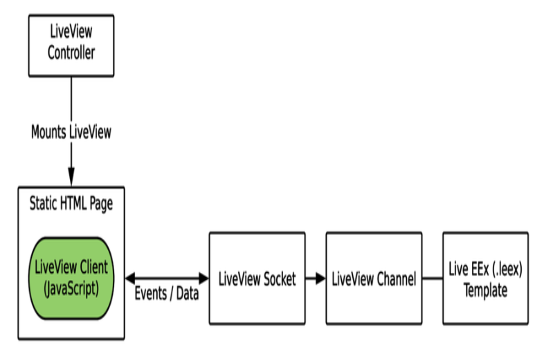
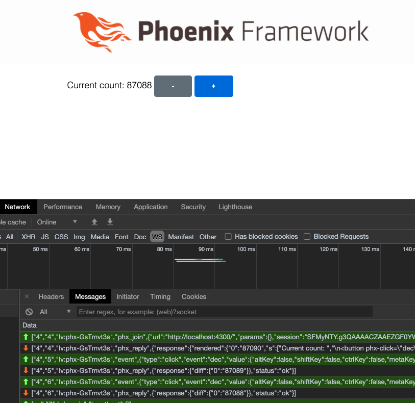

# Real-Time Phoenix 13. Phoenix LiveView

## by: hanzhupeng@gmail.com 2020-8-19

前面我们看到 Phoenix Channel 让实时应用的服务端开发轻松了很多，但是依然需要写大量的前端代码。如果能不写那些JavaScript前端呢？看看 Phoenix LiveView。

LiveView动摇了传统的实时应用的开发流程。在典型的web应用里，你把实时特性集成进一个标准的HTML + JS 的界面里。在前面第7章，我们通过船体HTML片段给前端，以及发送JSON数据给客户端。这两种情况下，都是前端收到Channel的消息并基于它的内容来修改界面。

LiveView 改变了这个范式，它用 Elixir 代码来定义应用的用户界面。通过从服务端向客户端发送内容差异，来让界面自动保持更新。几行JS代码来初始化LiveView，接下来由LiveView来处理DOM的更新。用LiveView，你可以不用写js代码来实现实时web应用。

## Getting Started with LiveView

### LiveView Overview

LiveView基于你已经熟悉的技术： Channel 和 Socket。它向前走了一步，提供了富客户端及服务端渲染引擎，提供了一个全栈的开发体验。



流程开始于一个web 请求，先渲染一个静态版本的LiveView，发给前端。然后客户端连接到后端服务器，把静态页面变成实时的LiveView。

当前端连接到后端的LiveView Socket，后端启动新的LiveView进程，后端进程基于当前状态渲染一个 Live EEx模板。当LiveView进程的状态改变时，LiveView将发送一个包含改变的最小的payload到前端。然后前端实时的显示正确的HTML。前端界面只要LiveView连接着，就会保持到最新的状态。前端也会发送事件（点击或输入等）到后端LiveView。

Live EEx 模板，就是普通的 EEx模板带了一个特殊的引擎，来高效的跟踪改变。LiveView本身实现了 Phoenix.Channel behaviour。

### 一个快速的 LiveView 例子

```elixir
defmodule LiveViewDemoWeb.CounterLive do
  use Phoenix.LiveView

  def render(assigns) do
    ~L"""
    Current count: <%= @count %>
    <button phx-click="dec">-</button>
    <button phx-click="inc">+</button>
    """
  end

  def mount(%{count: initial}, socket) do
    {:ok, assign(socket, :count, initial)}
  end

  def handle_event("dec", _value, socket) do
    {:noreply, update(socket, :count, &(&1 - 1))}
  end

  def handle_event("inc", _value, socket) do
    {:noreply, update(socket, :count, &(&1 + 1))}
  end
end
```

（这个例子跟十几年前看的Seaside的例子好像啊，都是服务端执行逻辑，进行渲染。底层实现机制不同，但本质目的一样.对比一下上下两端代码多么像啊）

[Seaside](http://seaside.st)

[Seaside Counter Demo](http://www.seaside.st/about/examples/counter)

```smalltalk
initialize
    super initialize.
    count := 0

renderContentOn: html
    html heading: count.
    html anchor 
        callback: [ count := count + 1 ];
        with: '++'.
    html space.
    html anchor
        callback: [ count := count - 1 ];
        with: '--'
```



可以看到WebSocket里的通讯，在点击按钮后向服务端发送事件，服务端发回 {diff: {"0": "87088"}}

我们定义了一个模板，初始状态，以及点击事件的处理函数。代码看上去像是GenServer，因为它就是一个GenServer！通过observer界面观察一下。

### 稳固的基础

LiveView 基于 Elixir, Channel 以及 WebSocket 这些已经熟悉且得到实证认可的技术。这些技术基础提供了扩展性。

LiveView的垂直扩展性来自 Elixir。它要面对的一个挑战是把状态存储在服务器端，然后快速的把改变部分发给客户端。这是Elixir擅长的领域，进程允许内存中保存状态，以及操作状态，可以通过多核无缝的垂直扩展。

Phoenix Channel 和 PubSub跨多服务器提供了横向扩展能力。

### LiveView的编程模型

LiveView的数据流基于受到认可的设计模式。应用中数据移动的方式会极大的影响扩展性和可维护性。虽然编程社区有时会很分裂，但又两个前端的模式变得流行：声明式用户界面 、 单向数据流。

在声明式用户界面编程，你描述在特定的状态下，应该看起来是什么样子的。例如：

```html
<div>
  <%= if will_rain?(state) do %>
    <span>It's going to rain</span>
  <% else %>
    <span>It's a clear day!</span>
  <% end %>
</div>
```

而命令式编程模型 (imperative) ,在收到数据后会直接操作DOM ：

```js
function setWeather(weather) {
    if (weather.willRain) {
        weatherElement.setText("It's going to rain") 
    } else {
        weatherElement.setText("It's a clear day!") 
    }
}
```

看上去区别不大，但是命令式编程模型在代码量大的时候就会很难管理。声明式编程让代码的分析、维护及增长更容易。

LiveView使用声明式编程模型。

（声明式编程模型，数据与代码统一）

LiveView的另一个重要特性是单向数据流。界面由当前状态决定，界面上的事件发给channel改变状态，对状态的改变令模板重新渲染，并把差异发回前端用户界面。

数据在这个模型里，按一个方向流动。这看上去是个小事，但当项目变大时，就显现出好处了。单向数据流比双向流更容易理解，并且是LiveView能够在Channel里脱离前端保持状态的原因。

### LiveView 如何改变内容

LiveView 管理内容有两个主要的基础：

1. 模板引擎，可以让数据高效的从服务端发送到客户端。
   LiveView的模板，用 Live EEx 模板引擎。它把模板的静态部分与动态部分分开。当动态部分改变时，引擎知道如何只发送改变的部分给客户端。

2. JavaScript，运行并解释更改的内容。它藏在下面。
  LiveView的前端用 morphdom 来操作DOM。LiveView的Javascript客户端还负责其他的事，如数据处理等。

## 构建一个 LiveView的商品页

回到第7章：构建一个实时运动鞋店的项目。商品页面列出了所有的鞋，显示他们是否发布，以及当前可用的尺码。当商品发布，或一个尺码的可用状态改变时，页面会实时变化。

我们已经通过 Channel 和 JavaScript 实现了一版，接下来用 LiveView 来实现，大部分Elixir代码都不需要动，只需要几行 JavaScript。

### 设置项目工程

mix.exs以及 package.json 中添加依赖库

在 Endpoint 下增加 live socket：

```elixir
  socket "/live", Phoenix.LiveView.Socket,
    websocket: true,
    longpoll: false
```

### 使用 LiveView

LiveView 核心的模块 use Phoenix.LiveView ，每个 LiveView必须定义 render/1 函数，大部分会定义一个 mount/2 函数，以及事件处理函数。

```elixir
defmodule Sneakers23Web.ProductPageLive do
  use Phoenix.LiveView

  alias Sneakers23Web.ProductView

  def render(assigns) do
    Phoenix.View.render(ProductView, "live_index.html", assigns)
  end

  # 将商品列表放入 socket 的state中，上面的render函数就可以使用了
  # 注意，书里的代码现在不能运行， mount/3 需要 params session socket 三个参数，增加 _sesion 参数即可
  def mount(_params, _session, socket) do
    {:ok, products} = Sneakers23.Inventory.get_complete_products()
    socket = assign(socket, :products, products)

    # 只有在连接到 Socket 模式时才需要订阅事件
    if connected?(socket) do
      # 订阅商品更新事件
      subscribe_to_products(products)
    end

    {:ok, socket}
  end

  defp subscribe_to_products(products) do
    Enum.each(products, fn %{id: id} ->
      Phoenix.PubSub.subscribe(Sneakers23.PubSub, "product:#{id}")
    end)
  end
  
  # LiveView 就是 GenServer，所以用 handle_info处理消息
  def handle_info(%{event: "released"}, socket) do
    {:noreply, load_products_from_memory(socket)}
  end

  def handle_info(%{event: "stock_change"}, socket) do
    {:noreply, load_products_from_memory(socket)}
  end

  defp load_products_from_memory(socket) do
    {:ok, products} = Sneakers23.Inventory.get_complete_products()
    assign(socket, :products, products)
  end
end
```

把之前的 product/index.eex 文件复制为 product/live_index.html.leex 就行了，直接可用。把layout 目录下的 app.html.eex 复制为 live.html.leex ，并修改里面的     <%= @inner_content %>


添加 Router 路由, 注意，书里版本有些旧，需要指定下 Live 的Layout。

```elixir
import Phoenix.LiveView.Router

scope "/", Sneakers23Web do
  pipe_through :browser
  #live "/drops", ProductPageLive
  live "/drops", ProductPageLive, layout: {Sneakers23Web.LayoutView, :live}
end
```

还有其它的方式可以挂载LiveView，可以在 controller里面渲染，可以在一个常规的Phoenix模板里，或者在其他的 LiveView里。

到此为止，已经可以在页面上显示静态页面。

第一次请求LiveView时，返回的是一个静态的页面，客户端js 之后再通过Socket 连接到Channel，进行后续实时的更新。因此这是适合搜索引擎抓取的！而且即使客户端禁止js 也可以使用。

按书中代码，将前端js 操作增加上。

```js
import { Socket } from "phoenix"
import LiveSocket from "phoenix_live_view"

export const productSocket = new Socket("/product_socket")

export function connectToLiveView() {
  const liveSocket = new LiveSocket("/live", Socket)
  liveSocket.connect()
}
```

```js
import { productSocket, connectToLiveView } from "./socket"

if (document.querySelectorAll("[data-phx-main]").length) {
  connectToLiveView()
} else {
```

由于 LiveView 还在快速的开发更新中，因此成书到现在，一些代码需要做些调整，但并不复杂。

我们用LiveView创建了新的页面，但我们并没有改动任何的业务代码！

实验一下效果。


## 多读代码里的文档 Life-cycle

 A LiveView begins as a regular HTTP request and HTML response,and then upgrades to a stateful view on client connect,  guaranteeing a regular HTML page even if JavaScript is disabled.  Any time a stateful view changes or updates its socket assigns, it is  automatically re-rendered and the updates are pushed to the client.

  You begin by rendering a LiveView typically from your router.
  When LiveView is first rendered, the `c:mount/3` callback is invoked
  with the current params, the current session and the LiveView socket.
  As in a regular request, `params` contains public data that can be
  modified by the user. The `session` always contains private data set
  by the application itself. The `c:mount/3` callback wires up socket
  assigns necessary for rendering the view. After mounting, `c:render/1`
  is invoked and the HTML is sent as a regular HTML response to the
  client.

  After rendering the static page, LiveView connects from the client
  to the server where stateful views are spawned to push rendered updates
  to the browser, and receive client events via `phx-` bindings. Just like
  the first rendering, `c:mount/3` is invoked  with params, session,
  and socket state, where mount assigns values for rendering. However
  in the connected client case, a LiveView process is spawned on
  the server, pushes the result of `c:render/1` to the client and
  continues on for the duration of the connection. If at any point
  during the stateful life-cycle a crash is encountered, or the client
  connection drops, the client gracefully reconnects to the server,
  calling `c:mount/3` once again.

