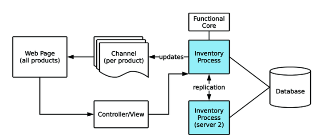

# Real-Time Phoenix 7, Build a Real-Time Sneaker Store

## by: hanzhupeng@gmail.com 2020-8-13

Part I 讲解了构造实时系统必要的技术主体，后续章节创建一个电子商务网站。

后面项目用 Ecto与数据库交互，用GenServer做快速的本地数据访问，创建一个可扩展的分布式系统。

项目是做一个在线运动鞋商店，看上去简单，但是在多用户同时访问时就会很复杂。（想起之前在小米做抢购系统了）。

## 产品需求

抢购。。。特定时间发布商品，聚集成千上万用户同时抢购。用户要实时看到商品的存货水平。

### 第一阶段目标

创建基本的页面，增加两个实时特性。

- 显示一个页面包含当前全部的商品
- 给购物者显示所有鞋子可用的尺码以及存货水平
- 发售时更新商品和存货
- 同时运行多个服务器

### 数据模型

表结构：

- Product (sku, price, ...)
- Item (Sku, Size)
- Availability (current_count)

Product 不能单独卖， product通过sku与size组合成 Item来卖， 可卖数量在另一个表保存。

### 开发系统架构

为了处理成千上万人同时数据请求，我们用 Elixir 的进程来保持当前应用的桩体。本地的状态要与其他服务器同步，崩溃后可恢复，并且它不用在要求必须正确的操作中（如支付）。



购买者的网页连接到 Phoenix的 controller，controller从库存进程里读取数据。购买者将浏览的每一个商品都连接一个Channel。Channel不从购买者哪里接受数据，它跟踪库存的更新。库存进程负责处理复制到其他服务器。数据库是数据的依据，用于读取库存购买操作。服务器用一个复制进程来向其他服务器发送存货更新消息，让它们总是保持正确的状态。

由于同时读取的请求非常多，数据库将成为瓶颈。因此库存进程扮演了Cache的角色，它保持一个正确（或接近正确）的库存数据。
（所有的读，从库存进程读；所有的更改，更改库存进程状态并写入数据库；库存进程重启时从数据库载入数据）

去网站下载本书附带的源代码，设置好项目，数据库等配置。iex下发布一个商品，并调用mock函数进行测试：

```elixir
iex(8)> Sneakers23.Inventory.mark_product_released!(1)  
iex(9)> Sneakers23Mock.InventoryReducer.sell_random_until_gone!(500)
```

不断刷新页面可以看到第一个商品各个尺码逐步变为售罄状态。

### 用 Channels渲染实时HTML

在 endpoint里添加一个Socket和相应的Channel。

这里使用了服务端的模板渲染，通过Channel的消息，把渲染好的部分的HTML字符串发送给前端。

```elixir
defmodule Sneakers23Web.ProductChannel do
  use Phoenix.Channel
  alias Sneakers23Web.{Endpoint, ProductView}

  def join("product:" <> _sku, %{}, socket) do
    {:ok, socket}
  end

  def notify_product_released(product = %{id: id}) do
    size_html = Phoenix.View.render_to_string(
      ProductView, "_sizes.html", product: product
    )

    Endpoint.broadcast!("product:#{id}", "released", %{
      size_html: size_html
    })
  end
end
```

在服务端渲染HTML，可以方便的测试，下面测试是否正确的广播了消息，以及消息里的HTML内容是否包含了商品的id信息。

```elixir
defmodule Sneakers23Web.ProductChannelTest do
  use Sneakers23Web.ChannelCase, async: true
  alias Sneakers23Web.{Endpoint, ProductChannel}

  alias Sneakers23.Inventory.CompleteProduct

  describe "nofity_product_released/1" do
    test "the size selector for the product is broadcast" do
      {inventory, _data} = Test.Factory.InventoryFactory.complete_products()
      [_, product] = CompleteProduct.get_complete_products(inventory)

      topic = "product:#{product.id}"
      Endpoint.subscribe(topic)
      ProductChannel.notify_product_released(product)

      assert_broadcast "released", %{size_html: html}
      assert html =~ "size-container__entry"
      Enum.each(product.items, fn item ->
        assert html =~ ~s(value="#{item.id}")
      end)
    end
  end
end
```

defdelegate  定义代理， 在 sneakers_23_web.ex：

```elixir
  defdelegate notify_product_released(product), to: Sneakers23Web.ProductChannel
```

在 inventory.ex 这个业务模块里，增加一个通知，这里用到上面定义的代理，直接使用 Sneakers23Web ，而不是用到更细节的内部实现，业务逻辑与网站的交互逻辑，尽量分离，将交互的消息通知等功能尽量封装。

```elixir
  def mark_product_released!(id), do: mark_product_released!(id, [])

  def mark_product_released!(product_id, opts) do
    pid = Keyword.get(opts, :pid, __MODULE__)

    %{id: id} = Store.mark_product_released!(product_id)
    {:ok, inventory} = Server.mark_product_released!(pid, id)

    ## add notify
    {:ok, product} = CompleteProduct.get_product_by_id(inventory, id)
    Sneakers23Web.notify_product_released(product)

    :ok
  end
```

#### 阅读源代码，了解一下Inventory 的实现

##### application.ex

进程监督树里挂在 Sneakers23.Inventory 进程：

```elixir
    children = [
      Sneakers23.Repo,
      Sneakers23Web.Endpoint,
      Sneakers23.Inventory
    ]
```

##### inventory.ex

child_spec ，可知实际启动的进程是 Sneakers23.Inventory.Server 模块

```elixir
  def child_spec(opts) do
    loader = Keyword.get(opts, :loader, DatabaseLoader)
    name = Keyword.get(opts, :name, __MODULE__)

    %{
      id: Server,
      start: {Server, :start_link, [[loader_mod: loader, name: name]]}
    }
  end
```

get_complete_products, 从 Server 进程中获取内存里的全部数据，然后 CompleteProduct.get_complete_products(inventory) 对数据进行树状结构化。

```elixir
  def get_complete_products(opts \\ []) do
    pid = Keyword.get(opts, :pid, __MODULE__)
    {:ok, inventory} = Server.get_inventory(pid)
    complete_products = CompleteProduct.get_complete_products(inventory)
    {:ok, complete_products}
  end
```

更新一个商品的发布状态，先在Store模块里操作数据库写出，然后在内存数据里更新，之后用广播消息发送给Channel：

```elixir
  def mark_product_released!(product_id, opts) do
    pid = Keyword.get(opts, :pid, __MODULE__)

    %{id: id} = Store.mark_product_released!(product_id)
    {:ok, inventory} = Server.mark_product_released!(pid, id)

    ## add notify
    {:ok, product} = CompleteProduct.get_product_by_id(inventory, id)
    Sneakers23Web.notify_product_released(product)

    :ok
  end
```

#### 前端的实现

前端页面，通过js把 DOM里所有 data-product-id 元素都找出来，然后对每一个product id 都连接一个channel, 在接到channel中的 released 事件后，将 DOM里的元素更换：

```js
import css from "../css/app.css"
import { productSocket } from "./socket"
import dom from './dom'
const productIds = dom.getProductIds()

if (productIds.length > 0) {
  productSocket.connect()
  productIds.forEach((id) => setupProductChannel(productSocket, id))
}

function setupProductChannel(socket, productId) {
  const productChannel = socket.channel(`product:${productId}`)
  productChannel.join()
    .receive("error", () => { console.error("Channel join failed")
  })
  productChannel.on('released', ({size_html}) => {
      dom.replaceProductComingSoon(productId, size_html)
  })
}
```

在 iex 里手动执行商品发布命令，看浏览器里 Network中，可以看到相应channel收到了消息，网页也立刻更新了：

```elixir
iex(4)> {:ok, products} = Sneakers23.Inventory.get_complete_products()
{:ok, ...
iex(7)> List.last(products) |> Sneakers23Web.notify_product_released()
:ok
```

### 用实时数据更新客户端

上面的例子直接在服务端发送渲染好的HTML块，下面直接在channel里传输更新的数据，用前端技术来更新页面状态。

stock_change 事件，包含 product_id, item_id, stock_level ，商品、尺码、库存水平。

product_channel 里增加 notify_item_stock_change 函数，给出新旧数量，判断网页显示是否一致，一致就不发送:

```elixir
  def notify_item_stock_change(
     %{available_count: old},
    %{available_count: new, id: id, product_id: p_id}
    ) do
      case {
        ProductView.availability_to_level(old),
        ProductView.availability_to_level(new)
      } do
        {same, same} when same != "out" -> {:ok, :no_change}

        {_, new_level} ->
          Endpoint.broadcast!("product:#{p_id}", "stock_change", %{
            product_id: p_id,
            item_id: id,
            level: new_level })
          {:ok, :broadcast}
        end
  end
```

在test代码里，测试两种情况。

在 Sneakers23Web 模块下增加代理声明：

```elixir
  defdelegate notify_item_stock_change(opts), to: Sneakers23Web.ProductChannel
```

app.js 中添加事件处理函数：

```js
function setupProductChannel(socket, productId) {
  const productChannel = socket.channel(`product:${productId}`)
  productChannel.join()
    .receive("error", () => { console.error("Channel join failed")
  })
  productChannel.on('released', ({size_html}) => {
      dom.replaceProductComingSoon(productId, size_html)
  })

  productChannel.on('stock_change', ({ product_id, item_id, level}) => {
      dom.updateItemLevel(item_id, level)
  })
}
```

在 iex 里实验

```elixir
iex(14)> %{items: items} = List.first(products) 
iex(15)> items |> Enum.take(6) |> Enum.each(fn item -> 
...(15)>   out_item = Map.put(item, :available_count, 0)
...(15)>   opts = [previous_item: item, current_item: out_item]
...(15)>   Sneakers23Web.notify_item_stock_change(opts)
...(15)> end)
```

## 运行多个服务器

用in-memory的数据结构，在运行多个服务器的时候会遇到一些困难，因为数据的更新不会自动的跨越集群。我们已经讨论过 Phoenix 如何处理广播消息，接下来用类似的方案在集群上广播库存的变化。

### 分布式的挑战

运行多个服务器时会遇到一个问题， Inventory.Server 进程只知道它自己的事务，（在这个实现里 Inventory.Server 是一个 GenServer，它在启动时，先通过Store模块读取数据库，在进程状态里保存了数据库所有数据的快照，对读取操作直接返回内存的状态，对修改操作，它先通过 Store进行数据库更新，然后更新自己的内存状态。）这意味着，如果在另一个节点上有商品的发布或售罄的操作，它在重启前是不会更新自己的数据的。

试验一下，打开两个 iex 进程，在back进程里执行发布操作，这时前端页面会响应，数据库数据被更新，但是当刷新页面时页面显示商品没有上线。因为 app 进程（前端连接到的那个服务器）里的内存数据并没有被更新，而notify消息通过Channel自动在及群里广播了，但数据更新操作没有被广播。

web 服务结点 app：

```elixir
$ iex --name app@127.0.0.1 -S mix phx.server
```

back 结点：

```elixir
$ iex --name back@127.0.0.1 -S mix
iex(back@127.0.0.1)4> Node.connect(:"app@127.0.0.1")
true
iex(back@127.0.0.1)5> Node.list
[:"app@127.0.0.1"]
iex(back@127.0.0.1)6> Sneakers23.Inventory.mark_product_released!(1)
```

back 上执行了数据库操作，并broadcast了消息，因为已经通过 Node.connect 了，这个消息通过Channel的底层机制自动广播给了app结点，并发送给了前端，前端实时显示了商品可售卖。但是app结点上的 Inventory.Server 进程并不知道，它内部的数据并没有更新。现在刷新浏览器会发现商品又变成了未发售状态。重启app结点后前端显示了正确的结果。

### 给库存事件添加复制机制

Phoenix PubSub不止可以用在Channel消息的复制上，在它的内核，它可以让任意的进程订阅特定的事件类型。

复制 replication 也有自己的问题，结点之间可能会出现不同步。对于非关键性的数据，做trade-off，扩展性带来的好处大于潜在的数据不正确。在这个商城程序里，对关键的操作如付款流程，是不能用复制到数据来作为可信数据源的。而是使用数据库来保证数据的一致性。
（由于我们现在的项目不涉及支付，很多内容的准确性要求可以放松）

用一个GenServer 在PubSub上订阅 "inventory_replication" 事件，并处理商品发布与售罄事件.
收到消息后，调用 Inventory 相应的函数处理，并附带指出是复制来的消息，因此特殊处理，不再进行广播，否则就无限循环了。

```elixir
defmodule Sneakers23.Replication.Server do
  use GenServer
  alias Sneakers23.Inventory

  def start_link(opts) do
    GenServer.start_link(__MODULE__, opts, name: __MODULE__)
  end

  def init(_opts) do
    Phoenix.PubSub.subscribe(Sneakers23.PubSub, "inventory_replication")
    {:ok, nil}
  end

  def handle_info({:mark_product_released!, product_id}, state) do
    Inventory.mark_product_released!(product_id, being_replicated?: true)
    {:noreply, state}
  end

  def handle_info({:item_sold!, id}, state) do
    Inventory.item_sold!(id, being_replicated?: true)
    {:noreply, state}
  end
end
```

Replication模块：

```elixir
defmodule Sneakers23.Replication do
  alias __MODULE__.{Server}

  defdelegate child_spec(opts), to: Server

  def mark_product_released!(product_id) do
    broadcast!({:mark_product_released!, product_id})
  end

  def item_sold!(item_id) do
    broadcast!({:item_sold!, item_id})
  end

  defp broadcast!(data) do
    Phoenix.PubSub.broadcast_from!(Sneakers23.PubSub,
      server_pid(),
      "inventory_replication",
      data
    )
  end
  defp server_pid(), do: Process.whereis(Server)
end
```

broadcast_from! 将发给除了自己外的其它进程。

将 Replication进程添加到 Application的进程树里。

修改 Inventory 的逻辑， 判断是否是复制的消息，如果不是复制到消息，就用 Replication进行复制广播，并对前端发出通知：

```elixir
  def mark_product_released!(id), do: mark_product_released!(id, [])

  def mark_product_released!(product_id, opts) do
    pid = Keyword.get(opts, :pid, __MODULE__)
    being_replicated? = Keyword.get(opts, :being_replicated?, false)


    %{id: id} = Store.mark_product_released!(product_id)
    {:ok, inventory} = Server.mark_product_released!(pid, id)

    ## add notify
    unless being_replicated? do
      Replication.mark_product_released!(product_id)
      {:ok, product} = CompleteProduct.get_product_by_id(inventory, id)
      Sneakers23Web.notify_product_released(product)
    end
    :ok
  end

  def item_sold!(id) do
    item_sold!(id, [])
  end

  def item_sold!(item_id, opts) do
    pid = Keyword.get(opts, :pid, __MODULE__)
    being_replicated? = Keyword.get(opts, :being_replicated?, false)

    avail = Store.fetch_availability_for_item(item_id)
    {:ok, old_inv, inv} = Server.set_item_availability(pid, avail)

    unless being_replicated? do
      Replication.item_sold!(item_id)
      {:ok, old_item} = CompleteProduct.get_item_by_id(old_inv, item_id)
      {:ok, item} = CompleteProduct.get_item_by_id(inv, item_id)
      Sneakers23Web.notify_item_stock_change(
        old_item, item
      )
    end
    :ok
  end
```

重新验证，在 back 服务器上执行 release等操作，前端实时响应正常，刷新页面正常，说明app 服务器里进程内的数据获得了正确的更新。

