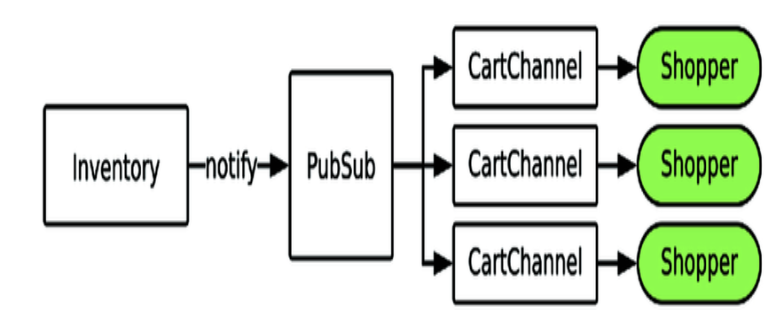

# Real-Time Phoenix 9. Build a Real-Time Shopping Cart

## By: hanzhupeng@gmail.com

本章一步步构造一个购物车，应用上书里讲过的各种概念：Channels, PubSub, Channel state, Javascript, Session state。还要考虑到各种可能的失效情况，如服务器崩溃，客户端断线，浏览器多窗口支持。最后进行验收测试。

## Plan Your Shopping Cart

购物车概念上很简单，就是把商品放入、移除，以及下单付款。我们的购物车要实现实时提醒功能，在商品售罄时能通知到购物者，让他们能尽快选择其他的尺码。

### 需求

- 添加删除多个商品到购物车
- 每种鞋只有一个尺码可以添加
- 当购物车中某个商品售罄时通知到购物者
- 页面刷新时，购物车能保持
- 在多个页面之间，一个购物者只有一个单独的购物车
- 购物者不用购物车无法下单
- 管理员可以看到不同的购物车里有什么商品（下一章）

### 设计应用架构

最重要的特性是商品售罄时及时通知用户，我们用 Phoenix PubSub来通知 Channel，每个Channel将更新数据通知给连接的客户端。



PubSub 有一个动态订阅的功能，进程可以订阅或取消订阅一个topic。一个Channel进程可以监听任意的PubSub topic，即使与它连接到的topic不同也可以。在购物车里添加或删除商品时，我们动态的添加或删除PubSub的订阅。这样一个Channel就不会收到不在购物车中的那些商品的消息了。

我们用 CartChannel 来处理用户的添加删除消息，这个Channel进程的状态里保存当前的购物车内容。

我们的购物车需要在多个页面或者在页面reload的时候能保持，而不会消失。有几种方法，如用数据库，或者用Elixir的进程来保存购物者的购物车。我们的需求没有要求将购物车保持一个很长的时间，因此用简单的方法，存在浏览器的本地存储里。

如果用户开了多个tab，那么就有多个连接和多个Channel。当某个tab的购物车有更新操作时，它相应的Channel就进行广播，相同用户的其他channel收到消息后就更新各自的数据和客户端。

### 设置项目，构建商店购物车Channel的架子

把业务逻辑、数据结构放在功能内核里，与用户交互的部分独立开。分离界面与逻辑，可以曾庆可维护性，两边都可以改变而不需要完全的重写。

我们编写一个 ShoppingCart 数据结构来保存购物车的数据，将这些代码加入 Checkout context。

### 构造一个功能内核

开始编写一个新特性时，首先从最核心的部分开始。Checkout.ShoppingCart 是业务逻辑内核(Model)，包含数据结构（items 列表），添加、删除，以及序列号、反序列化，这里使用 Token来进行验证防止被伪造:

```elixir
defmodule Sneakers23.Checkout.ShoppingCart do
  defstruct items: []

  def new(), do: %__MODULE__{}

  def add_item(cart = %{items: items}, id) when is_integer(id) do
    if id in items do
      {:error, :duplicate_item}
    else
      {:ok, %{cart | items: [id | items]}}
    end
  end

  def remove_item(cart = %{items: items}, id) when is_integer(id) do
    if id in items do
      {:ok, %{cart | items: List.delete(items, id)}}
    else
      {:error, :not_found}
    end
  end

  def item_ids(%{items: items}), do: items

  @base Sneakers23Web.Endpoint
  @salt "shopping cart serialization"
  @max_age 86400 * 7

  def serialize(cart = %__MODULE__{}) do
    {:ok, Phoenix.Token.sign(@base, @salt, cart, max_age: @max_age)}
  end

  def deserialize(serialized) do
    case Phoenix.Token.verify(@base, @salt, serialized, max_age: @max_age)
    do
      {:ok, data} ->
        items = Map.get(data, :items, [])
        {:ok, %__MODULE__{items: items}}

      e = {:error, _reason} ->
        e
    end
  end
end
```

通过Checkout Context模块，将内部的函数代理出来，提供调用接口。

```elixir
defmodule Sneakers23.Checkout do
  alias __MODULE__.{ShoppingCart}

  defdelegate add_item_to_cart(cart, item), to: ShoppingCart, as: :add_item
  defdelegate cart_item_ids(cart), to: ShoppingCart, as: :item_ids
  defdelegate export_cart(cart), to: ShoppingCart, as: :serialize
  defdelegate remove_item_from_cart(cart, item), to: ShoppingCart, as: :remove_item

  def restore_cart(nil), do: ShoppingCart.new()
  def restore_cart(serialized) do
    case ShoppingCart.deserialize(serialized) do
      {:ok, cart} -> cart
      {:error, _} -> restore_cart(nil)
    end
  end
  @cart_id_length 64
  def generate_cart_id() do
    :crypto.strong_rand_bytes(@cart_id_length)
    |> Base.encode64()
    |> binary_part(0, @cart_id_length)
  end
end
```

### 准备HTML

用户打开多个窗口，要都保持同步，每一个窗口是一个不同的Channel 实例，我们要用一种方法把他们都连接起来。最简单的办法是通过Channel topic，用 "cart:<cart_id>" 。我们用一个随机数生成 cart_id 存到cookie中.

我们希望每一个页面上都有cart_id 功能，我们可以通过在Controller里复制粘贴同样的代码块，但是有更简单的方法，就是使用 Plug库，创建下面的 Plug模块，加入到 router里：

```elixir
defmodule Sneakers23Web.CartIdPlug do
  import Plug.Conn
  def init(_), do: []

  def call(conn, _) do
    {:ok, conn, cart_id} = get_cart_id(conn)
    assign(conn, :cart_id, cart_id)
  end

  defp get_cart_id(conn) do
    case get_session(conn, :cart_id) do
      nil ->
        cart_id = Sneakers23.Checkout.generate_cart_id()
        {:ok, put_session(conn, :cart_id, cart_id), cart_id}

      cart_id ->
        {:ok, conn, cart_id}

    end
  end
end
```

在 layout 里加入购物车相关的前端代码，这样每个页面都包含了cart_id .

这样浏览器多个tab里， window.cartId 都是同一个值。

### 构建购物车Channel

在购物车Channel进程里，保存购物车的数据，处理添加，删除商品操作，与客户端同步，实时更新商品库存。（这里把购物车的数据放在Channel进程的状态里，如果有多个页面，就会有多个Channel进程，购物车数据会复制多份。如果用单独的一个GenServer来保存和处理更好，数据不需要重复，也不需要复制）

用 "cart:*" topic 来连接channel。在ProductSocket中添加路由：

```elixir
defmodule Sneakers23Web.ProductSocket do
  use Phoenix.Socket

  ## Channels
  channel "product:*", Sneakers23Web.ProductChannel
  channel "cart:*", Sneakers23Web.ShoppingCartChannel
  
  def connect(_params, socket, _connect_info) do
    {:ok, socket}
  end

  def id(_socket), do: nil
end
```

ShoppingCartChannel

```elixir
defmodule Sneakers23Web.ShoppingCartChannel do
  use Phoenix.Channel

  alias Sneakers23.Checkout
  def join("cart:" <> id, params, socket) when byte_size(id) == 64do
    cart = get_cart(params)
    socket = assign(socket, :cart, cart)
    {:ok, socket}
  end

  defp get_cart(params) do
    params
    |> Map.get("serialized", nil)
    |> Checkout.restore_cart()
  end

end
```

将客户端本地保存到cart数据恢复到Channel的状态中。

把购物车数据里的id列表，变成具体的数据结构，这部分功能与Channel无关，放在单独的View模块里：

```elixir
defmodule Sneakers23Web.CartView do
  def cart_to_map(cart) do
    {:ok, serialized} = Sneakers23.Checkout.export_cart(cart)
    {:ok, products} = Sneakers23.Inventory.get_complete_products()
    item_ids = Sneakers23.Checkout.cart_item_ids(cart)
    items = render_items(products, item_ids)
    %{items: items, serialized: serialized}
  end

  defp render_items(_, []), do: []

  defp render_items(products, item_ids) do
    for product <- products,
        item <- product.items,
        item.id in item_ids do
      render_item(product, item)
    end
    |> Enum.sort_by(& &1.id)
  end

  @product_attrs [
    :brand, :color, :name, :price_usd, :main_image_url, :released
  ]

  @item_attrs [:id, :size, :sku]

  defp render_item(product, item) do
    product_attributes = Map.take(product, @product_attrs)
    item_attributes = Map.take(item, @item_attrs)
    product_attributes
    |> Map.merge(item_attributes)
    |> Map.put(:out_of_stock, item.available_count == 0)
  end
end
```

这段代码根据 item id，把商品重要属性取出来，然后加入当前是否售罄的状态信息。在 ShoppingCartChannel 里添加通知客户端的代码

```elixir
defmodule Sneakers23Web.ShoppingCartChannel do
  use Phoenix.Channel
  import Sneakers23Web.CartView, only: [cart_to_map: 1]

  alias Sneakers23.Checkout
  def join("cart:" <> id, params, socket) when byte_size(id) == 64do
    cart = get_cart(params)
    socket = assign(socket, :cart, cart)
    send(self(), :send_cart)
    {:ok, socket}
  end

  def handle_info(:send_cart, socket = %{assign: %{cart: cart}}) do
    push(socket, "cart", cart_to_map(cart))
    {:noreply, socket}
  end
end
```

注意：在 join 函数里，用 send(self(),..) 的方式，来进行后续的 push 。用服务端Channel push的方法来通知客户端，而不是靠客户端来请求，这样可以保证数据的时效性。

下面是前端代码部分， app.js  cart.js  .在这个示例里，cart使用 ProductSocket，join进 cart:{cartId} topic . cartId 来自之前在layout中添加的 window.cartId

```js
const cartChannel = socket.channel(`cart:${cartId}`, channelParams) 
```

#### 向购物车中添加和删除商品

在 ShoppingCartChannel 中添加add_item 消息的处理：

```elixir
  def handle_in(
    "add_item", %{"item_id" => id}, socket = %{assigns: %{cart: cart}}) do
    case Checkout.add_item_to_cart(cart, String.to_integer(id)) do
      {:ok, new_cart} ->
        socket = assign(socket, :cart, new_cart)
        {:reply, {:ok, cart_to_map(new_cart)}, socket}

      {:error, :duplicate_item} ->
        {:reply, {:error, %{error: "duplicate_item"}}, socket}
    end
  end
```

这是可以测试访问下，打开两个tab，在其中一个添加商品，会发现两个tab购物车不同步。

#### 同步多个Channel的客户端

```elixir
  intercept ["cart_updated"]

  def handle_in(
    "add_item", %{"item_id" => id}, socket = %{assigns: %{cart: cart}}) do
    case Checkout.add_item_to_cart(cart, String.to_integer(id)) do
      {:ok, new_cart} ->
        broadcast_cart(new_cart, socket, added: [id])
        socket = assign(socket, :cart, new_cart)
        {:reply, {:ok, cart_to_map(new_cart)}, socket}

      {:error, :duplicate_item} ->
        {:reply, {:error, %{error: "duplicate_item"}}, socket}
    end
  end

  def handle_out("cart_updated", params, socket) do
    cart = get_cart(params)
    socket = assign(socket, :cart, cart)
    push(socket, "cart", cart_to_map(cart))

    {:noreply, socket}
  end

  defp broadcast_cart(cart, socket, opts) do
    {:ok, serialized} = Checkout.export_cart(cart)

    broadcast_from(socket, "cart_updated", %{
      "serialized" => serialized,
      "added" => Keyword.get(opts, :added, []),
      "removed" => Keyword.get(opts, :removed, [])
    })
  end
```

handle_in("add_item", ..) 中，调用 broadcast_cart ， 发出一个 "cart_update" 消息，（完整的cart，added 和 removed）。
拦截 "cart_updated" 事件，将串行化的购物车数据转换成真正的购物车信息，发给连接到的客户端，并且更新Channel 的state。

删除商品的代码类似。

### 添加实时售罄警告

使用动态 PubSub 订阅

进程可以订阅和取消订阅任意的PubSub topic, 一个进程可以订阅任意多的topic。每一个商品有一个topic，格式为 "item_out:{id}" 。
购物车需要订阅它里面当前所有商品，从购物车移除商品时取消订阅相关的商品。

```elixir
defmodule Sneakers23Web.ShoppingCartChannel do
  use Phoenix.Channel

  alias Sneakers23.Checkout

  import Sneakers23Web.CartView, only: [cart_to_map: 1]

  intercept ["cart_updated"]

  # join 进来时,把原来保存的cart里的项目全部订阅一遍
  def join("cart:" <> id, params, socket) when byte_size(id) == 64 do
    cart = get_cart(params)
    socket = assign(socket, :cart, cart)
    send(self(), :send_cart)
    enqueue_cart_subscriptions(cart)

    {:ok, socket}
  end

  # 接收 PubSub广播的商品售罄消息
  def handle_info({:item_out, _id}, socket = %{assigns: %{cart: cart}}) do
    push(socket, "cart", cart_to_map(cart))
    {:noreply, socket}
  end

  # 订阅一个商品的topic
  def handle_info({:subscribe, item_id}, socket) do
    Phoenix.PubSub.subscribe(Sneakers23.PubSub, "item_out:#{item_id}")
    {:noreply, socket}
  end

  def handle_info({:unsubscribe, item_id}, socket) do
    Phoenix.PubSub.unsubscribe(Sneakers23.PubSub, "item_out:#{item_id}")
    {:noreply, socket}
  end

  # 添加一个商品时,先订阅它,然后广播给其他的channel
  def handle_in(
    "add_item", %{"item_id" => id}, socket = %{assigns: %{cart: cart}}) do
    case Checkout.add_item_to_cart(cart, String.to_integer(id)) do
      {:ok, new_cart} ->
        send(self(), {:subscribe, id})
        broadcast_cart(new_cart, socket, added: [id])
        socket = assign(socket, :cart, new_cart)
        {:reply, {:ok, cart_to_map(new_cart)}, socket}

      {:error, :duplicate_item} ->
        {:reply, {:error, %{error: "duplicate_item"}}, socket}
    end
  end

  def handle_in(
    "remove_item", %{"item_id" => id}, socket = %{assigns: %{cart: cart}}) do
    case Checkout.remove_item_from_cart(cart, String.to_integer(id)) do
      {:ok, new_cart} ->
        send(self(), {:unsubscribe, id})
        broadcast_cart(new_cart, socket, removed: [id])
        socket = assign(socket, :cart, new_cart)
        {:reply, {:ok, cart_to_map(new_cart)}, socket}

      {:error, :not_found} ->
        {:reply, {:error, %{error: "not_found"}}, socket}
    end
  end

  defp broadcast_cart(cart, socket, opts) do
    {:ok, serialized} = Checkout.export_cart(cart)

    broadcast_from(socket, "cart_updated", %{
      "serialized" => serialized,
      "added" => Keyword.get(opts, :added, []),
      "removed" => Keyword.get(opts, :removed, [])
    })
  end

  def handle_out("cart_updated", params, socket) do
    # 购物车有更新时调用更改订阅
    modify_subscriptions(params)
    cart = get_cart(params)
    socket = assign(socket, :cart, cart)
    push(socket, "cart", cart_to_map(cart))

    {:noreply, socket}
  end
  defp modify_subscriptions(%{"added" => add, "removed" => remove}) do
    Enum.each(add, & send(self(), {:subscribe, &1}))
    Enum.each(remove, & send(self(), {:unsubscribe, &1}))
  end
  # 将购物车里的项目全部订阅一遍
  defp enqueue_cart_subscriptions(cart) do
    cart
    |> Checkout.cart_item_ids()
    |> Enum.each(fn id ->
      send(self(), {:subscribe, id})
    end)
  end

  defp modify_subscriptions(%{"added" => add, "removed" => remove}) do
    Enum.each(add, & send(self(), {:subscribe, &1}))
    Enum.each(remove, & send(self(), {:unsubscribe, &1}))
  end
end
```

发布商品售罄事件:

```elixir
  def notify_local_item_stock_change(%{available_count: 0, id: id}) do
    Sneakers23.PubSub
    |> Phoenix.PubSub.node_name()
    |> Phoenix.PubSub.direct_broadcast(
      Sneakers23.PubSub, "item_out:#{id}", {:item_out, id}
    )
  end

  def notify_local_item_stock_change(_), do: false
```

当 available_count 为0 的时候进行发布(注意这里的模式匹配的用法,省去了判断的代码),这里只在当前的node上进行广播,如果向素有的结点广播,有可能会出现竞争条件.我们需要在每个结点上都运行 notify_local_item_stock_change, 在 item_sold!/2 函数里调用它. item_sold!/2会在每一个结点上都运行,然后各自去在各自的结点上进行广播.

```elixir
  def item_sold!(id), do: item_sold!(id, [])

  def item_sold!(item_id, opts) do
    pid = Keyword.get(opts, :pid, __MODULE__)
    being_replicated? = Keyword.get(opts, :being_replicated?, false)

    avail = Store.fetch_availability_for_item(item_id)
    {:ok, old_inv, inv} = Server.set_item_availability(pid, avail)
    {:ok, item} = CompleteProduct.get_item_by_id(inv, item_id)
    unless being_replicated? do
      Replication.item_sold!(item_id)
      {:ok, old_item} = CompleteProduct.get_item_by_id(old_inv, item_id)
      {:ok, item} = CompleteProduct.get_item_by_id(inv, item_id)

      Sneakers23Web.notify_item_stock_change(
        previous_item: old_item,
        current_item: item
      )
    end
    Sneakers23Web.notify_local_item_stock_change(item)
    :ok
  end
```

### 添加支付流程

```elixir
  def purchase_cart(cart, opts \\ []) do
    Sneakers23.Repo.transaction(fn ->
      Enum.each(cart_item_ids(cart), fn id ->
        case Sneakers23.Checkout.SingleItem.sell_item(id, opts) do
          :ok ->
            :ok
          _ ->
            Sneakers23.Repo.rollback(:purchase_failed)
        end
      end)

    :purchase_complete
    end)
  end
```

这里使用数据库的事务,购物车里每一个商品都执行更新,如果有失败的则全部回滚.

## 验收测试

